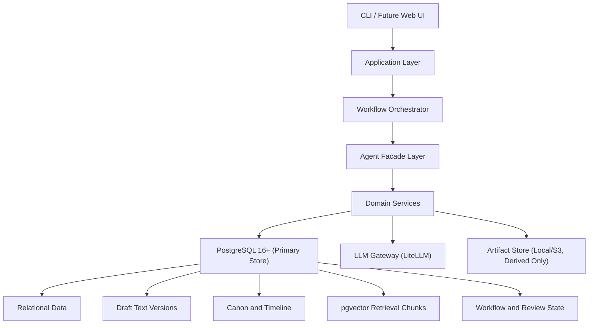

# BestSeller — 长篇小说 AI 生产系统架构设计

**版本**: 2.0  
**日期**: 2026-03-18  
**状态**: Unified Draft

## 1. 这次统一后的核心决策

本轮方案统一后，BestSeller 不再采用 `SQLite + Markdown 真值源 + ChromaDB` 的混合假设，而是明确采用下面这套架构：

1. **PostgreSQL 16+ 是唯一主数据库**
   - 承担结构化数据、正文版本、事实系统、工作流状态、质量报告、检索索引元数据。

2. **PostgreSQL 是单一真值源**
   - `scene draft`、`chapter draft` 等正文内容直接存 PostgreSQL。
   - Markdown / DOCX / EPUB / PDF 都是导出产物，不是权威数据源。

3. **向量检索内建到 PostgreSQL**
   - 使用 `pgvector`。
   - 不再以 ChromaDB 作为默认方案。
   - 检索采用“结构过滤 + 向量召回 + 词法补充”的混合策略。

4. **统一 ID 策略**
   - 全域主键统一为 `UUID`。
   - 章节顺序、场景顺序使用业务字段 `chapter_number`、`scene_number`，不依赖自增 ID 表达顺序。

5. **规划产物必须入库**
   - `Premise`、`BookSpec`、`WorldSpec`、`CastSpec`、`VolumePlan` 等中间产物全部版本化保存。

6. **工作流状态必须可恢复**
   - 生成流水线、重写流水线、人工确认点、失败重试、LLM 调用痕迹都持久化。

7. **导出文件是衍生物**
   - 支持导出到本地目录或对象存储。
   - 但导出文件和数据库不再并列为“双真值源”。

## 2. 为什么旧方案不成立

旧方案最主要的问题不是某一个技术选型，而是边界不一致：

1. `Architecture` 把领域模型设计成 `UUID/string ID`，`database-schema` 却用自增整数。
2. `Architecture` 说正文不存数据库，只存文件路径；`database-schema` 又把正文全文直接放进 `scene_drafts.content`。
3. `Architecture` 说 SQLite 是真值源，Markdown 是正文源，ChromaDB 是检索源，导致实际变成三套存储真值。
4. `config/default.yaml` 已经给出异步数据库 URL，但依赖里没有补齐 `asyncpg`，入口脚本也还没落地。

如果继续沿旧设计实现，结果一定是：

- 迁移困难
- 一致性规则无法落地
- 批量重写无法稳定回写
- “数据库中的状态”和“磁盘上的正文”长期漂移

因此这轮修订的目标不是“把 SQLite 换成 PostgreSQL”这么简单，而是**统一整套写入模型**。

## 3. 修订后的总体架构



### 3.1 分层职责

| 层 | 职责 | 不应承担 |
| --- | --- | --- |
| CLI / Web UI | 接收命令、展示进度、处理人工确认 | 业务规则、直接 SQL |
| Application Layer | 编排用例、权限、事务边界 | Prompt 细节 |
| Workflow Orchestrator | 运行 Novel/Chapter/Rewrite 流水线 | 直接拼接上下文文本 |
| Agent Facade Layer | 调用 LLM、渲染 Prompt、解析结构化输出 | 直接更新多张业务表 |
| Domain Services | Canon、Timeline、Context、Rewrite、Quality 的领域逻辑 | Provider SDK 细节 |
| PostgreSQL | 结构化和文本真值源、检索和工作流状态 | 业务决策 |
| Artifact Store | 导出物、快照、报告附件 | 事实真值 |

## 4. 修订后的存储原则

### 4.1 单一真值源

以下对象在 PostgreSQL 中保存权威版本：

- 项目配置
- 风格指南
- 世界观与角色实体
- 规划中间产物
- 章纲与场景卡
- 场景正文与章节正文的版本历史
- Canon 事实、时间线事件、角色认知状态
- 审校报告、质量分、重写任务
- 检索 chunk 与向量
- 工作流和 LLM 调用日志

### 4.2 衍生物

以下内容是导出物，不参与真值竞争：

- `full_novel.md`
- `full_novel.docx`
- `full_novel.epub`
- `quality-report.json`
- `review-report.html`
- 提供给作者下载或协作的快照包

### 4.3 为什么正文也要进 PostgreSQL

正文不是“大文件”场景，单章几千字、整书几十万到几百万字，对 PostgreSQL 的 `TEXT` 完全在合理范围内。把正文放在数据库里有三个直接好处：

1. 版本化和事务一致性更强。
2. 重写任务、事实抽取、审校报告可以和正文版本精确绑定。
3. 不需要解决“数据库状态更新了，但 Markdown 没写成功”这类双写问题。

## 5. 目录结构

```text
bestseller/
├── pyproject.toml
├── README.md
├── Makefile
├── .env.example
├── config/
│   ├── default.yaml
│   └── prompts/
├── docs/
│   ├── architecture.md
│   ├── database-schema.md
│   ├── prompt-engineering-strategy.md
│   └── novel-framework-research-and-proposal.md
├── src/
│   └── bestseller/
│       ├── __init__.py
│       ├── cli/
│       │   └── main.py
│       ├── app/
│       │   ├── commands/
│       │   └── use_cases/
│       ├── domain/
│       │   ├── project.py
│       │   ├── planning.py
│       │   ├── character.py
│       │   ├── canon.py
│       │   ├── draft.py
│       │   ├── review.py
│       │   └── workflow.py
│       ├── services/
│       │   ├── planning_service.py
│       │   ├── context_service.py
│       │   ├── canon_service.py
│       │   ├── timeline_service.py
│       │   ├── quality_service.py
│       │   ├── rewrite_service.py
│       │   ├── retrieval_service.py
│       │   └── export_service.py
│       ├── agents/
│       │   ├── base.py
│       │   ├── story_architect.py
│       │   ├── canon_keeper.py
│       │   ├── chapter_planner.py
│       │   ├── scene_planner.py
│       │   ├── scene_writer.py
│       │   ├── continuity_editor.py
│       │   └── style_editor.py
│       ├── workflows/
│       │   ├── novel_pipeline.py
│       │   ├── chapter_pipeline.py
│       │   ├── rewrite_pipeline.py
│       │   └── worker.py
│       ├── infra/
│       │   ├── db/
│       │   │   ├── session.py
│       │   │   ├── models/
│       │   │   ├── repositories/
│       │   │   └── migrations/
│       │   ├── llm/
│       │   │   └── gateway.py
│       │   ├── retrieval/
│       │   │   └── pgvector_store.py
│       │   └── artifacts/
│       │       └── store.py
│       └── utils/
│           ├── prompt_renderer.py
│           ├── token_budget.py
│           └── ids.py
└── tests/
```

## 6. 核心领域对象

### 6.1 项目与规划对象

- `Project`
- `StyleGuide`
- `PlanningArtifactVersion`
  - `premise`
  - `book_spec`
  - `world_spec`
  - `cast_spec`
  - `volume_plan`
  - `chapter_outline_batch`

### 6.2 写作对象

- `Volume`
- `Chapter`
- `SceneCard`
- `SceneDraftVersion`
- `ChapterDraftVersion`

### 6.3 一致性对象

- `CanonFact`
- `TimelineEvent`
- `CharacterStateSnapshot`
- `CharacterKnowledge`
- `ForeshadowingSeed`
- `RewriteTask`
- `RewriteImpact`

### 6.4 质量与审计对象

- `ReviewReport`
- `QualityScore`
- `WorkflowRun`
- `WorkflowStepRun`
- `LlmRun`
- `ExportArtifact`

## 7. 统一后的 ID 与版本策略

### 7.1 ID

统一使用 `UUID` 作为主键，原因如下：

1. 文档、数据库、API 可以统一。
2. 后续如果接入 Web UI、异步 worker、批量导入导出，不需要重构 ID 体系。
3. 这个项目的数据规模远没到 UUID 成本成为瓶颈的程度。

### 7.2 排序字段

顺序永远用业务字段表达：

- `volume_number`
- `chapter_number`
- `scene_number`
- `version_no`
- `story_order`

### 7.3 版本对象

以下对象必须显式保留版本：

- 规划产物
- Scene draft
- Chapter draft
- 审校报告
- Prompt 模板版本引用

## 8. 七个核心 Agent 的最终职责边界

### 8.1 Story Architect

- 负责：`Premise`、`BookSpec`、`VolumePlan`
- 输入：项目定位、风格、历史规划摘要
- 输出：结构化规划产物

### 8.2 Canon Keeper

- 负责：事实抽取、冲突检测、时间线更新
- 输入：当前 draft、相关 canon、角色状态
- 输出：`CanonFact`、`TimelineEvent`、冲突报告

### 8.3 Chapter Planner

- 负责：卷纲到章纲
- 输入：当前卷目标、主线摘要、活跃伏笔
- 输出：`Chapter` 的结构化计划

### 8.4 Scene Planner

- 负责：章纲到 `SceneCard`
- 输入：章目标、角色状态、地点、相关 thread
- 输出：完整场景卡

### 8.5 Scene Writer

- 负责：`SceneCard -> SceneDraftVersion`
- 输入：三级上下文
- 输出：正文初稿

### 8.6 Continuity Editor

- 负责：事实一致性、认知一致性、时间线一致性、POV 边界
- 输出：`ReviewReport`

### 8.7 Style Editor

- 负责：风格修订、钩子强化、语言节奏
- 输出：修订版正文或风格审校报告

## 9. 检索架构

### 9.1 检索原则

检索不是把整本书重新塞给模型，而是分三路装配：

1. **结构化强约束**
   - 当前 SceneCard
   - 当前 Chapter 目标
   - POV 与出场角色状态
   - 相关 WorldRules
   - 当前有效 CanonFacts

2. **语义召回**
   - 相似历史片段
   - 同地点/同 thread 历史场景
   - 相关摘要

3. **压缩背景**
   - 本卷摘要
   - 主线推进摘要
   - 未回收伏笔摘要

### 9.2 检索实现

默认使用 PostgreSQL 内的混合检索：

- `pgvector` 做语义相似度召回
- `pg_trgm` 做角色别名、地点名、关键词召回
- 结构过滤保证只取“当前时点有效”的状态和事实

### 9.3 为什么不再默认用 ChromaDB

1. 多存储组件会让迁移、备份、运维和一致性复杂度上涨。
2. 对当前阶段的项目规模，PostgreSQL + pgvector 已经足够。
3. 检索与业务数据放在同一库里，更适合做“时间点过滤”和“角色状态过滤”。

## 10. 工作流设计

### 10.1 Novel Pipeline

```text
IDEA
  -> PREMISE_GENERATED
  -> BOOK_SPEC_GENERATED
  -> HUMAN_APPROVED_BOOK_SPEC
  -> WORLD_SPEC_GENERATED
  -> CAST_SPEC_GENERATED
  -> HUMAN_APPROVED_CAST
  -> VOLUME_PLAN_GENERATED
  -> HUMAN_APPROVED_VOLUME
  -> CHAPTER_WRITING_LOOP
```

### 10.2 Chapter Pipeline

```text
1. Load chapter target
2. Assemble current structured state
3. Generate / update SceneCards
4. Generate scene drafts
5. Run continuity review
6. Run style edit
7. Persist chapter draft version
8. Extract canon and timeline updates
9. Refresh summaries and retrieval chunks
```

### 10.3 Rewrite Pipeline

```text
1. Detect trigger
2. Build impact graph
3. Produce rewrite task batch
4. Human confirm batch
5. Execute in dependency order
6. Re-run review and canon sync
7. Mark clean / reopen if conflict remains
```

## 11. 事务与一致性边界

### 11.1 单事务内必须同时完成的写入

以下写入必须同事务提交：

- 新的 `SceneDraftVersion`
- 当前版本指针切换
- 对应 `WorkflowStepRun` 状态变更
- 相关 `ReviewReport` / `RewriteTask` 状态联动

### 11.2 可异步延后执行的写入

以下内容可以走后台任务：

- `retrieval_chunks` 重建
- 导出文件刷新
- 报告 HTML 生成
- 长期统计指标聚合

### 11.3 并发控制

关键对象使用：

- `lock_version`
- `SELECT ... FOR UPDATE`
- 后台 worker 通过 `FOR UPDATE SKIP LOCKED` 抢任务

这样不用额外引入 Redis，也能先把工作流跑稳。

## 12. 质量保障体系

### 12.1 规则检查

- 角色名漂移
- POV 越界
- 时间线逆序
- 章节字数异常
- 违禁词
- 已失效 canon 被继续使用

### 12.2 模型评审

- 场景目标是否达成
- 冲突强度
- 情绪推进
- 对话质量
- 钩子强度
- 风格一致性

### 12.3 全局分析

- 伏笔回收率
- 支线遗失率
- 设定污染率
- 人物状态异常漂移
- 爽点/揭示/高潮节奏

## 13. 对当前方案的补强点

相比旧方案，这次补了四个之前缺失但必须有的对象：

1. **PlanningArtifactVersion**
   - 让 `Premise/BookSpec/WorldSpec/CastSpec` 不再只存在于文档里。

2. **WorkflowRun / WorkflowStepRun**
   - 让中断恢复和失败重试可实现。

3. **LlmRun**
   - 让 Prompt 版本、模型、Token 成本、响应质量可追溯。

4. **RetrievalChunk**
   - 让检索成为数据库内的正式数据模型，而不是外挂缓存。

## 14. 最终建议的技术底座

### 必选

- Python 3.11+
- FastAPI / Typer
- SQLAlchemy 2.x
- Alembic
- PostgreSQL 16+
- pgvector
- LiteLLM
- Pydantic v2

### 可选

- 本地 artifact store
- S3/MinIO artifact store
- 观测平台
- Web UI

## 15. 实施顺序

### Phase 1

- 建立 PostgreSQL schema
- 落 `Project / PlanningArtifact / Chapter / SceneCard / DraftVersion`
- 跑通 `BookSpec -> Chapter -> Scene`

### Phase 2

- 落 `CanonFact / TimelineEvent / CharacterStateSnapshot`
- 跑通 `SceneDraft -> Canon 回写 -> Summary 更新`

### Phase 3

- 落 `ReviewReport / QualityScore / RewriteTask / RewriteImpact`
- 跑通自动审校和局部重写

### Phase 4

- 落 `RetrievalChunk / hybrid retrieval / ExportArtifact / Workflow worker`
- 跑通长篇持续生产

---

这版架构的核心不是“更复杂”，而是**把数据真值、正文真值、检索真值和工作流真值统一到了一个主数据库上**。只有这样，长篇小说的稳定生成、全局改设定后的影响分析、局部重写和质量闭环才真正可实现。

