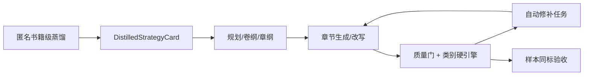

# 小说框架全类型自闭环能力报告

Generated at: `2026-05-17T02:33:43+00:00`
Overall status: `repairable`

## Summary

- Categories: `12`
- Status counts: `{"repairable": 12}`
- Distillation status counts: `{"generic_fallback": 11, "category_specific": 1}`

## Closed Loop

## Category Cards

| Category | Status | Taxonomy | Distillation | Aggregate | Maturity | Blocking/Fix Count |
| --- | --- | --- | --- | --- | --- | ---: |
| action-progression | repairable | aligned | generic_fallback | distillation-generic | production/0.97 | 1 |
| strategy-worldbuilding | repairable | aligned | generic_fallback | distillation-generic | production/0.97 | 1 |
| suspense-mystery | repairable | aligned | generic_fallback | distillation-generic | production/0.97 | 1 |
| otherworld-cross-system | repairable | aligned | category_specific | otherworld-cross-system | unsafe/0.27 | 1 |
| base-building | repairable | aligned | generic_fallback | distillation-generic | production/0.97 | 1 |
| relationship-driven | repairable | aligned | generic_fallback | distillation-generic | production/0.97 | 1 |
| esports-competition | repairable | aligned | generic_fallback | distillation-generic | production/0.97 | 1 |
| female-growth-ncp | repairable | aligned | generic_fallback | distillation-generic | production/0.97 | 1 |
| eastern-aesthetic | repairable | aligned | generic_fallback | distillation-generic | production/0.97 | 1 |
| urban-contemporary | repairable | aligned | generic_fallback | distillation-generic | production/0.97 | 1 |
| science-fiction-progression | repairable | aligned | generic_fallback | distillation-generic | production/0.97 | 1 |
| wuxia-jianghu | repairable | aligned | generic_fallback | distillation-generic | production/0.97 | 1 |

## Backlog

| ID | P | Category | Code | Owner | Action | Acceptance |
| --- | --- | --- | --- | --- | --- | --- |
| SELF-CLOSURE-001 | P2 | action-progression | category_specific_distillation_missing | 结构蒸馏负责人 | Run safe anonymous distillation for this category and aggregate to `data/distillation/aggregates/action-progression`; then rerun framework self-closure audit. | `compile_distilled_strategy_card(category_key='action-progression')` resolves aggregate_key `action-progression` with anti-copy boundaries and state variables. |
| SELF-CLOSURE-005 | P2 | base-building | category_specific_distillation_missing | 结构蒸馏负责人 | Run safe anonymous distillation for this category and aggregate to `data/distillation/aggregates/base-building`; then rerun framework self-closure audit. | `compile_distilled_strategy_card(category_key='base-building')` resolves aggregate_key `base-building` with anti-copy boundaries and state variables. |
| SELF-CLOSURE-009 | P2 | eastern-aesthetic | category_specific_distillation_missing | 结构蒸馏负责人 | Run safe anonymous distillation for this category and aggregate to `data/distillation/aggregates/eastern-aesthetic`; then rerun framework self-closure audit. | `compile_distilled_strategy_card(category_key='eastern-aesthetic')` resolves aggregate_key `eastern-aesthetic` with anti-copy boundaries and state variables. |
| SELF-CLOSURE-007 | P2 | esports-competition | category_specific_distillation_missing | 结构蒸馏负责人 | Run safe anonymous distillation for this category and aggregate to `data/distillation/aggregates/esports-competition`; then rerun framework self-closure audit. | `compile_distilled_strategy_card(category_key='esports-competition')` resolves aggregate_key `esports-competition` with anti-copy boundaries and state variables. |
| SELF-CLOSURE-008 | P2 | female-growth-ncp | category_specific_distillation_missing | 结构蒸馏负责人 | Run safe anonymous distillation for this category and aggregate to `data/distillation/aggregates/female-growth-ncp`; then rerun framework self-closure audit. | `compile_distilled_strategy_card(category_key='female-growth-ncp')` resolves aggregate_key `female-growth-ncp` with anti-copy boundaries and state variables. |
| SELF-CLOSURE-004 | P2 | otherworld-cross-system | distillation_maturity_low | 结构蒸馏负责人 | Run safe anonymous distillation for this category and aggregate to `data/distillation/aggregates/otherworld-cross-system`; then rerun framework self-closure audit. | Maturity score is >= 0.30 and no fallback placeholders leak into planning artifacts. |
| SELF-CLOSURE-006 | P2 | relationship-driven | category_specific_distillation_missing | 结构蒸馏负责人 | Run safe anonymous distillation for this category and aggregate to `data/distillation/aggregates/relationship-driven`; then rerun framework self-closure audit. | `compile_distilled_strategy_card(category_key='relationship-driven')` resolves aggregate_key `relationship-driven` with anti-copy boundaries and state variables. |
| SELF-CLOSURE-011 | P2 | science-fiction-progression | category_specific_distillation_missing | 结构蒸馏负责人 | Run safe anonymous distillation for this category and aggregate to `data/distillation/aggregates/science-fiction-progression`; then rerun framework self-closure audit. | `compile_distilled_strategy_card(category_key='science-fiction-progression')` resolves aggregate_key `science-fiction-progression` with anti-copy boundaries and state variables. |
| SELF-CLOSURE-002 | P2 | strategy-worldbuilding | category_specific_distillation_missing | 结构蒸馏负责人 | Run safe anonymous distillation for this category and aggregate to `data/distillation/aggregates/strategy-worldbuilding`; then rerun framework self-closure audit. | `compile_distilled_strategy_card(category_key='strategy-worldbuilding')` resolves aggregate_key `strategy-worldbuilding` with anti-copy boundaries and state variables. |
| SELF-CLOSURE-003 | P2 | suspense-mystery | category_specific_distillation_missing | 结构蒸馏负责人 | Run safe anonymous distillation for this category and aggregate to `data/distillation/aggregates/suspense-mystery`; then rerun framework self-closure audit. | `compile_distilled_strategy_card(category_key='suspense-mystery')` resolves aggregate_key `suspense-mystery` with anti-copy boundaries and state variables. |
| SELF-CLOSURE-010 | P2 | urban-contemporary | category_specific_distillation_missing | 结构蒸馏负责人 | Run safe anonymous distillation for this category and aggregate to `data/distillation/aggregates/urban-contemporary`; then rerun framework self-closure audit. | `compile_distilled_strategy_card(category_key='urban-contemporary')` resolves aggregate_key `urban-contemporary` with anti-copy boundaries and state variables. |
| SELF-CLOSURE-012 | P2 | wuxia-jianghu | category_specific_distillation_missing | 结构蒸馏负责人 | Run safe anonymous distillation for this category and aggregate to `data/distillation/aggregates/wuxia-jianghu`; then rerun framework self-closure audit. | `compile_distilled_strategy_card(category_key='wuxia-jianghu')` resolves aggregate_key `wuxia-jianghu` with anti-copy boundaries and state variables. |
