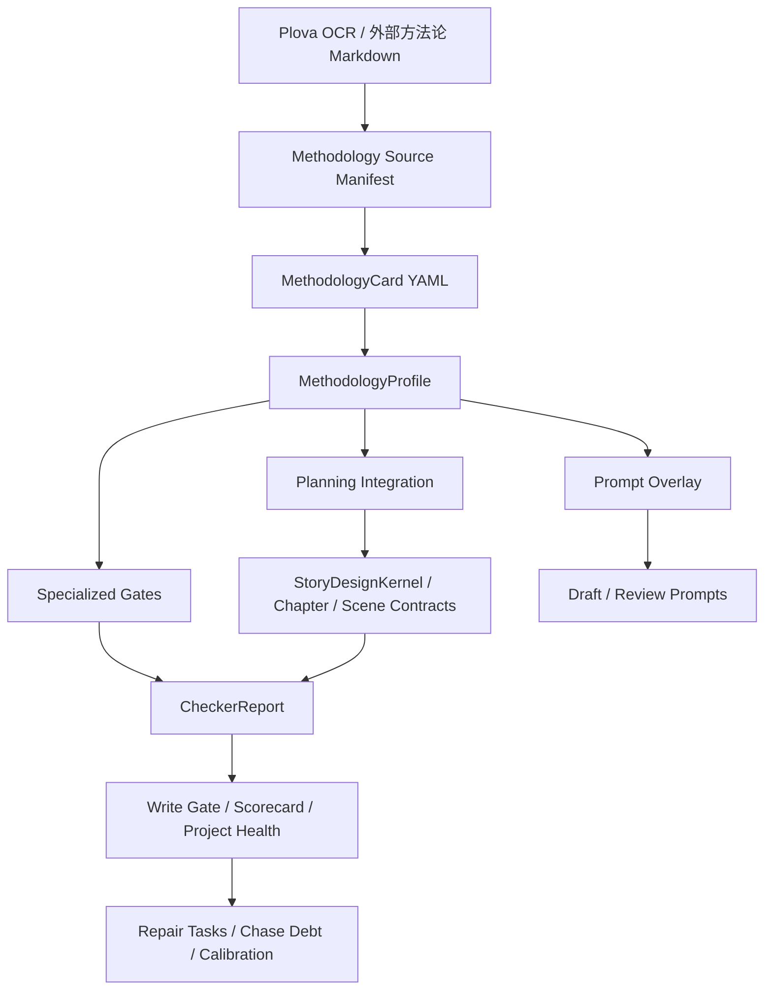

# 方法论驱动的 BestSeller 框架优化方案设计与开发计划

## 0. 文档定位

本文档把 `docs/plans/2026-05-21-plova-methodology-framework-optimization.md` 作为需求输入，进一步落成可开发的框架优化方案。

目标不是把 Plova 方法论简单塞进 prompt，而是让 BestSeller 具备一条稳定能力链：

```text
外部写作方法论
  -> 可追溯方法论资产
  -> 项目/题材方法论配置
  -> 规划与写作合约
  -> CheckerReport 门禁
  -> Scorecard / Project Health 聚合
  -> 修复任务与追债闭环
```

本方案按“先低风险资产化，再接入现有 overlay，最后新增专项 gate”的顺序推进，避免一次性大改生成链。

## 1. 总体目标

### 1.1 业务目标

1. 将 Plova OCR 文档中的 35 条有效方法论转成可追溯、可配置、可执行的框架能力。
2. 让作者/编辑能看到当前项目启用了哪些方法论、哪些方法论被触发、哪些违规需要修复。
3. 补齐现有框架在“契诃夫之枪、前三章职责、打斗结构、冰山显隐、长篇失控指数”上的能力缺口。
4. 让后续猫神、七猫、番茄、编辑部规则等外部方法论都可以复用同一套导入路径。

### 1.2 技术目标

1. 新增方法论资产层，提供 `MethodologyCard`、`MethodologyProfile`、`MethodologyBinding`。
2. 复用现有 `methodology_overlay`、`StoryDesignKernel`、`CheckerReport`、`quality_gates.yaml`、`project_health`、`scorecard`。
3. 新增三类高收益专项门禁：
   - `OpeningThreeFunctionGate`
   - `ActionSceneStructureGate`
   - `ChekhovEmphasisGate`
4. 第二阶段新增聚合型健康指标：
   - `LongformChaosIndex`
   - `MethodologyCoverageReport`
5. 所有新增检查器必须输出统一 `CheckerReport`，并能进入现有阻断/审计/追债流程。

### 1.3 非目标

1. 不在第一阶段新建数据库表。
2. 不在第一阶段改变整书生成主链默认行为。
3. 不把所有方法论设为 strict。
4. 不把 OCR 原文直接注入 writer prompt。
5. 不重写现有 `StoryDesignKernel`、`narrative_lines`、`foreshadowing`、`hype_engine`。

## 2. 当前框架可复用能力

| 能力 | 当前落点 | 本次复用方式 |
| --- | --- | --- |
| 方法论轻量合约 | `src/bestseller/services/methodology_overlay.py` | 扩展输入字段和 profile 渲染，不另起 prompt 系统 |
| 章节因果门禁 | `src/bestseller/services/chapter_causality_gate.py` | 复用 pressure/action/cost/gain/state_change/next_desire 轴 |
| 方法论模式 | `methodology_contract_mode=off/warn/strict` | 新 profile 继承该模式，并允许单 gate 覆盖 |
| 统一检查器输出 | `src/bestseller/services/checker_schema.py` | 新 gate 全部返回 `CheckerReport` |
| Gate 配置 | `config/quality_gates.yaml`、`quality_gates_config.py` | 新增 `methodology_framework` 配置块 |
| 黄金三章健康 | `src/bestseller/services/reader_power.py`、`project_health.py` | 升级为“强刺激 + 职责分工”双检查 |
| 伏笔密度 | `src/bestseller/services/foreshadowing.py` | 保持 clue/payoff，新增 Chekhov emphasis 作为相邻但不同轴 |
| 爽点引擎 | `src/bestseller/services/hype_engine.py` | 动作场景可引用 hype type，但不混同动作结构 |
| 四线架构 | `src/bestseller/services/narrative_lines.py` | 和 Plova 主线/角色线/世界线/伏笔线做术语映射 |
| 项目健康报告 | `src/bestseller/services/project_health.py` | 聚合 methodology coverage、opening、chekhov、chaos 指标 |
| Scorecard 聚合 | `src/bestseller/services/scorecard.py` | 新 issue code 进入 top_issue_codes 和 blocked chapter 统计 |

## 3. 目标架构

### 3.1 分层设计



### 3.2 核心原则

1. **方法论资产和检查器分离**：卡片描述“应该怎么判断”，gate 负责“怎么计算”。
2. **来源可追溯**：任何规则都能回到 OCR 文档的作品编号、标题、锚点、OCR 状态。
3. **默认审计优先**：新规则默认 `audit_only` 或 `warn`，只有硬事实、强承诺、黄金三章核心风险可升级为 block。
4. **先 YAML 后 DB**：第一阶段使用 repo 内 YAML 和 Pydantic 加载，稳定后再决定是否持久化到数据库。
5. **不重复造轮子**：能由 `chapter_causality_gate`、`scene_plan_richness`、`foreshadowing`、`reader_power` 解决的，不新增平行系统。

## 4. 数据与配置设计

### 4.1 Methodology Source Manifest

路径建议：

```text
data/methodology_sources/plova/manifest.yaml
```

用途：记录来源元数据和 OCR 可信状态。

字段：

```yaml
source_set_id: plova_douyin_2026_05_21
author: Plova
source_markdown: douyin_plova/plova_douyin_ocr.md
captured_at: "2026-05-21T17:48:10+08:00"
items:
  - source_id: plova.01
    aweme_id: "7642246827189800207"
    title: "结构化创作：经典原则03——冰山理论"
    anchor: "#01-7642246827189800207"
    image_count: 5
    ocr_status: ok
    topics: ["iceberg", "surface_subtext"]
  - source_id: plova.36
    aweme_id: "7615583461797491557"
    title: "#小说创作 #写作技巧 #网文干货 #网文写手 #长篇小说创作"
    image_count: 0
    ocr_status: pending
    topics: []
```

### 4.2 MethodologyCard

路径建议：

```text
data/methodology_sources/plova/cards.yaml
```

Pydantic 模型建议放在：

```text
src/bestseller/services/methodology_cards.py
```

字段：

```yaml
cards:
  - id: plova.chekhov.emphasized_item_must_payoff
    source_ids: ["plova.02", "plova.03"]
    title: "契诃夫之枪：被强调的元素必须承担功能"
    category: "foreshadowing"
    scope: ["scene", "chapter", "asset"]
    stage: ["planning", "review", "repair"]
    core_claim: "被明显强调的物、规则、能力、台词，后文必须有功能性使用。"
    anti_patterns:
      - "重要道具被重点描写后再无作用"
      - "把所有伏笔都写得过重，导致兑现压力失衡"
    required_contract_fields:
      - "emphasized_item"
      - "expected_function"
      - "payoff_window"
    gate_bindings:
      - gate: "chekhov_emphasis"
        default_mode: "audit_only"
    framework_bindings:
      - "scene_contracts.metadata.chekhov"
      - "chapter_contracts.metadata.emphasized_items"
      - "clues.metadata.dual_type"
    maturity: "draft"
```

枚举建议：

| 枚举 | 值 |
| --- | --- |
| `scope` | `book`, `volume`, `chapter`, `scene`, `asset`, `project_health` |
| `stage` | `planning`, `drafting`, `review`, `repair`, `health` |
| `category` | `opening`, `mainline`, `foreshadowing`, `worldview`, `character`, `action_scene`, `timeline`, `longform_control`, `surface_subtext` |
| `maturity` | `draft`, `verified`, `pending_source`, `deprecated` |

### 4.3 MethodologyProfile

用途：项目或题材选择哪些卡片启用，以及各自模式。

路径建议：

```text
config/methodology_profiles/plova_structured_writing.yaml
```

示例：

```yaml
profile_id: plova_structured_writing_v1
default_mode: warn
cards:
  plova.opening.three_chapter_function:
    enabled: true
    gate_mode: audit_only
    strict_when:
      - "chapter_number <= 3"
  plova.action_scene.goal_cost_turn:
    enabled: true
    gate_mode: audit_only
  plova.chekhov.emphasized_item_must_payoff:
    enabled: true
    gate_mode: audit_only
  plova.iceberg.surface_subtext:
    enabled: true
    gate_mode: advisory
pending_sources:
  - plova.36
  - plova.37
  - plova.38
```

加载器建议：

```text
src/bestseller/services/methodology_profile.py
```

职责：

1. 加载 card 和 profile。
2. 解析启用卡片。
3. 过滤 pending source。
4. 渲染规划期和审校期 prompt block。
5. 为 gate 提供启用/模式查询。

### 4.4 quality_gates 配置扩展

在 `config/quality_gates.yaml` 增加：

```yaml
methodology_framework:
  enabled: true
  profile_id: plova_structured_writing_v1
  cards:
    enabled: true
    data_dir: data/methodology_sources/plova
  opening_three_function:
    enabled: true
    default: audit_only
    block_until_chapter: 3
  action_scene_structure:
    enabled: true
    default: audit_only
  chekhov_emphasis:
    enabled: true
    default: audit_only
    overdue_window_default: 8
  longform_chaos:
    enabled: false
    start_after_chapter: 30
```

在 `quality_gates_config.py` 增加 dataclass：

```python
@dataclass(frozen=True)
class MethodologyFrameworkConfig:
    enabled: bool = False
    profile_id: str = "plova_structured_writing_v1"
    cards_enabled: bool = True
    data_dir: str = "data/methodology_sources/plova"
    opening_three_function_enabled: bool = True
    action_scene_structure_enabled: bool = True
    chekhov_emphasis_enabled: bool = True
    longform_chaos_enabled: bool = False
```

## 5. 新增模块设计

### 5.1 `methodology_cards.py`

职责：

1. Pydantic 校验 `MethodologyCard`。
2. 加载 manifest/cards YAML。
3. 提供 `list_cards()`、`get_card(id)`、`cards_by_category()`。
4. 输出覆盖率报告。

主要函数：

```python
def load_methodology_source_set(path: Path) -> MethodologySourceSet
def load_methodology_cards(path: Path) -> MethodologyCardDeck
def validate_card_sources(deck: MethodologyCardDeck, source_set: MethodologySourceSet) -> tuple[MethodologyFinding, ...]
def methodology_coverage_summary(deck: MethodologyCardDeck) -> dict[str, Any]
```

测试：

```text
tests/unit/test_methodology_cards.py
```

验收：

1. 35 条有效来源有 card 覆盖。
2. 第 36-38 条被识别为 pending，不能进入 verified card。
3. 缺 source、scope、stage、category 时校验失败。

### 5.2 `methodology_profile.py`

职责：

1. 解析 profile。
2. 计算项目启用方法论。
3. 渲染 prompt block。
4. 为 gate 提供开关。

主要函数：

```python
def load_methodology_profile(profile_id: str) -> MethodologyProfile
def enabled_cards(profile: MethodologyProfile, deck: MethodologyCardDeck, *, stage: str, scope: str) -> tuple[MethodologyCard, ...]
def render_methodology_profile_block(profile: MethodologyProfile, *, stage: str, scope: str, language: str = "zh-CN") -> str
def gate_mode_for_card(profile: MethodologyProfile, card_id: str) -> str
```

测试：

```text
tests/unit/test_methodology_profile.py
```

验收：

1. 能按 stage/scope 筛选卡片。
2. pending source 卡不会进入默认 block。
3. 渲染内容不超过可控长度，避免 prompt 污染。

### 5.3 `opening_three_function_gate.py`

覆盖方法论：

1. 小说开头翻车避坑指南。
2. 小说前三章分工。
3. 热闹开头为什么留不住人。

输入：

```python
Sequence[tuple[int, str]]  # chapter_texts
Sequence[ChapterOutlineInput | Mapping[str, Any]]  # 可选章纲
Sequence[tuple[int, HypeType | str | None]]  # 可选 hype
```

检查轴：

| 章节 | 必须有 |
| --- | --- |
| 第 1 章 | 主角处境、异常压力、第一追问 |
| 第 2 章 | 压力扩大、代价证明、主角选择 |
| 第 3 章 | 状态变化、更大问题、第四章欲望 |

输出 issue codes：

| Code | 说明 | 默认 |
| --- | --- | --- |
| `OPENING_CH1_PRESSURE_MISSING` | 第一章缺主角压力 | audit_only |
| `OPENING_CH2_COST_PROOF_MISSING` | 第二章缺代价证明 | audit_only |
| `OPENING_CH3_LONG_DESIRE_MISSING` | 第三章未转成长线欲望 | audit_only |
| `OPENING_THREE_REPEATED_STIMULUS` | 三章重复刺激，无递进 | audit_only |

与现有能力关系：

1. 不替代 `reader_power.analyze_golden_three`。
2. `reader_power` 看 hype/hook，本 gate 看职责分工和读者欲望递进。
3. `project_health` 同时展示两份报告。

测试：

```text
tests/unit/test_opening_three_function_gate.py
```

### 5.4 `action_scene_structure_gate.py`

覆盖方法论：

1. 打斗场面为什么不燃。
2. 怎么把打斗写出情绪。
3. 华丽又不空的打斗怎么写。
4. 一场打斗怎么搭结构。

触发条件：

1. scene type 包含 `fight`、`battle`、`action`、`combat`。
2. 文本命中“打斗/战斗/交手/厮杀/追击/伏击/出手”等关键词。
3. `methodology_contract.action_sequence` 非空。

检查字段：

```yaml
fight_objective
failure_cost
opponent_advantage
tactic_shift
emotion_driver
turning_point
exit_state_delta
next_aftereffect
```

输出 issue codes：

| Code | 说明 | 默认 |
| --- | --- | --- |
| `ACTION_SCENE_OBJECTIVE_MISSING` | 打斗缺目标 | audit_only |
| `ACTION_SCENE_FAILURE_COST_MISSING` | 打斗缺失败代价 | audit_only |
| `ACTION_SCENE_TACTIC_SHIFT_MISSING` | 打斗只有动作无策略变化 | audit_only |
| `ACTION_SCENE_EMOTION_DRIVER_MISSING` | 打斗缺情绪驱动 | audit_only |
| `ACTION_SCENE_STATE_DELTA_MISSING` | 打完局面无变化 | audit_only |

与现有能力关系：

1. 复用 `normalize_scene_overlay()`。
2. 扩展 scene overlay 支持 action scene aliases。
3. 可调用 `chapter_causality_gate` 的 token 检测思想，但单独输出 action-scene agent。

测试：

```text
tests/unit/test_action_scene_structure_gate.py
tests/unit/test_methodology_overlay.py  # 扩展字段 normalize/render 测试
```

### 5.5 `chekhov_emphasis_gate.py`

覆盖方法论：

1. 契诃夫之枪。
2. 契诃夫之枪不等于伏笔。
3. 伏笔为什么总是埋得下却收不回来。

第一阶段不做全文 NLP 自动抽取，先基于结构化输入：

```yaml
chapter_contract.metadata.emphasized_items:
  - item: "铜镜裂纹"
    prominence: "high"
    expected_function: "映出父亲旧名"
    expected_use_by_chapter: 5
    status: "planted"
```

检查：

1. 高显著元素必须有 `expected_function`。
2. `expected_use_by_chapter` 早于当前章节且 status 未完成，则输出 overdue。
3. 与 clue/payoff 可关联，但不强制等同。

输出 issue codes：

| Code | 说明 | 默认 |
| --- | --- | --- |
| `CHEKHOV_EXPECTED_FUNCTION_MISSING` | 强调物缺后续功能 | audit_only |
| `CHEKHOV_USE_OVERDUE` | 强调物逾期未使用 | audit_only，可后续进 debt |
| `CHEKHOV_PROMINENCE_TOO_HEAVY_FOR_MINOR_CLUE` | 小伏笔写得过重 | advisory |

测试：

```text
tests/unit/test_chekhov_emphasis_gate.py
```

### 5.6 `methodology_health.py`

职责：

1. 聚合方法论覆盖。
2. 聚合 opening/action/chekhov gate 报告。
3. 为 `project_health` 提供 methodology section。
4. 第二阶段计算 `LongformChaosIndex`。

报告形状：

```python
{
    "methodology_profile_id": "plova_structured_writing_v1",
    "coverage": {
        "source_items": 38,
        "verified_sources": 35,
        "pending_sources": 3,
        "cards": 35,
        "gate_backed_cards": 12,
    },
    "active_gates": ["opening_three_function", "action_scene_structure", "chekhov_emphasis"],
    "top_methodology_issues": [...],
    "pending_sources": ["plova.36", "plova.37", "plova.38"],
}
```

测试：

```text
tests/unit/test_methodology_health.py
tests/unit/test_project_health.py
```

## 6. 现有模块改动清单

### 6.1 `methodology_overlay.py`

改动：

1. 扩展 `normalize_scene_overlay()`：
   - `fight_objective`
   - `failure_cost`
   - `opponent_advantage`
   - `tactic_shift`
   - `emotion_driver`
   - `turning_point`
   - `exit_state_delta`
   - `next_aftereffect`
2. 扩展 `render_overlay_prompt_block()`，但只在字段存在时渲染。
3. 扩展 `validate_scene_methodology_contract()`，对 action scene 做专项 required fields。

注意：

1. 不破坏现有别名。
2. 不把 action scene 字段设为所有场景必填。
3. 保持低信号文本检测。

### 6.2 `quality_gates_config.py`

改动：

1. 新增 `MethodologyFrameworkConfig`。
2. 从 `quality_gates.yaml` 加载 `methodology_framework`。
3. 增加默认值，保证缺配置时历史项目不受影响。

### 6.3 `project_health.py`

改动：

1. 在 `build_project_health_report()` 中加入 methodology health。
2. 在 `repair_project_health()` 中新增 actions：
   - `repair_opening_three_function`
   - `review_action_scene_structure`
   - `review_chekhov_overdue`
   - `review_methodology_pending_sources`

### 6.4 `scorecard.py`

第一阶段不改 `NovelScorecard` 字段，只让新 gate 的 issue 进入 `aggregate_checker_reports()` 的 top issue codes。

第二阶段可考虑新增：

```python
methodology_coverage: float
opening_function_score: float
action_scene_structure_score: float
chekhov_debt_count: int
longform_chaos_index: float
```

### 6.5 `reviews.py` / `drafts.py`

第一阶段只接入 profile prompt block，不改变主 prompt 框架：

1. 写作阶段只注入当前 scope/stage 的短 block。
2. 审校阶段注入 card ids 和检查标准。
3. action scene 只在 scene 类型或关键词触发时注入。

## 7. 开发计划

### Milestone 0: 需求固化与测试夹具

目标：把当前需求变成可测试输入，不改运行链。

任务：

1. 创建 `data/methodology_sources/plova/manifest.yaml`。
2. 创建 `data/methodology_sources/plova/cards.yaml`，覆盖 35 条有效 OCR 方法论。
3. 抽取 6 组测试 fixture：
   - opening good/bad
   - action scene good/bad
   - chekhov good/bad
4. 增加文档说明 pending source 处理原则。

验收：

1. `rg "plova.36" data/methodology_sources/plova` 能看到 pending。
2. 35 条有效方法论都有 card。
3. 不涉及运行时行为变化。

预计改动文件：

```text
data/methodology_sources/plova/manifest.yaml
data/methodology_sources/plova/cards.yaml
tests/fixtures/methodology/plova_*.yaml
```

### Milestone 1: 方法论资产加载器

目标：支持加载、校验、查询方法论资产。

任务：

1. 实现 `src/bestseller/services/methodology_cards.py`。
2. 实现 `MethodologyCard`、`MethodologySourceItem`、`MethodologyCardDeck`。
3. 实现 source validation 和 coverage summary。
4. 单元测试覆盖：
   - 正常加载。
   - source 缺失。
   - pending source 不能 verified。
   - category/scope/stage 查询。

验收命令：

```bash
pytest tests/unit/test_methodology_cards.py -q
```

### Milestone 2: Profile 与 overlay 接入

目标：项目可选择方法论 profile，并在 prompt/contract 层可见。

任务：

1. 新增 `config/methodology_profiles/plova_structured_writing.yaml`。
2. 实现 `src/bestseller/services/methodology_profile.py`。
3. 扩展 `methodology_overlay.py` 支持 action scene 字段。
4. 在 `reviews.py` / `drafts.py` 的现有 overlay block 后追加 profile block，默认短输出。
5. 增加 `quality_gates_config.py` 的 methodology framework 配置。

验收命令：

```bash
pytest tests/unit/test_methodology_profile.py tests/unit/test_methodology_overlay.py tests/unit/test_story_principle_gate.py -q
```

验收标准：

1. 默认配置缺失时不影响现有测试。
2. profile block 可按 stage/scope 渲染。
3. action scene 字段只在相关场景出现。

### Milestone 3: 三个专项 gate

目标：用 CheckerReport 形式输出可聚合的专题检查结果。

任务 A：OpeningThreeFunctionGate

1. 新增 `src/bestseller/services/opening_three_function_gate.py`。
2. 与 `reader_power.analyze_golden_three()` 并列，不替代。
3. 新增 `tests/unit/test_opening_three_function_gate.py`。

任务 B：ActionSceneStructureGate

1. 新增 `src/bestseller/services/action_scene_structure_gate.py`。
2. 先支持结构化 scene overlay，再支持文本关键词 fallback。
3. 新增 `tests/unit/test_action_scene_structure_gate.py`。

任务 C：ChekhovEmphasisGate

1. 新增 `src/bestseller/services/chekhov_emphasis_gate.py`。
2. 先使用 contract metadata，不做自动抽取。
3. 新增 `tests/unit/test_chekhov_emphasis_gate.py`。

验收命令：

```bash
pytest tests/unit/test_opening_three_function_gate.py tests/unit/test_action_scene_structure_gate.py tests/unit/test_chekhov_emphasis_gate.py -q
```

验收标准：

1. 每个 gate 返回 `CheckerReport`。
2. issue code 稳定。
3. hard/soft 分区符合 `can_override`。
4. 对空输入安全返回 pass 或 audit summary。

### Milestone 4: Project Health 聚合

目标：作者能在项目健康报告中看到方法论风险。

任务：

1. 新增 `src/bestseller/services/methodology_health.py`。
2. 在 `project_health.build_project_health_report()` 中加入 `methodology` 节点。
3. 在 `repair_project_health()` 中加入建议动作。
4. 补充 CLI 输出或 JSON 保持兼容。

验收命令：

```bash
pytest tests/unit/test_methodology_health.py tests/unit/test_project_health.py tests/unit/test_cli.py -q
```

验收标准：

1. 没有 profile 时返回 disabled。
2. profile 启用时显示 coverage、pending sources、active gates。
3. opening/action/chekhov 的问题能进入 repair actions。

### Milestone 5: LongformChaosIndex

目标：为中后期长篇失控提供聚合指标。

输入：

1. line gap / line dominance。
2. overdue clues。
3. setup payoff debts。
4. stale entries。
5. timeline regression / countdown issues。
6. world reveal leak / over-budget。
7. outline executability / scene richness failures。

输出：

```python
{
    "enabled": true,
    "score": 0.0-1.0,
    "risk_level": "low|medium|high|critical",
    "components": {
        "line_balance": 0.72,
        "foreshadowing_debt": 0.40,
        "timeline_stability": 0.90,
        "entry_freshness": 0.66,
        "world_reveal_control": 0.80,
        "outline_executability": 0.70,
    },
    "top_repairs": [...]
}
```

验收：

1. 30 章前默认只 audit，不给强风险结论。
2. 每个分量有独立解释。
3. 指标可被 project health 展示，不阻断写作。

## 8. Sprint 拆分建议

### Sprint 1: 资产层

交付：

1. manifest/cards YAML。
2. `methodology_cards.py`。
3. 单元测试。

成功标准：

1. 35/35 有效方法论被结构化。
2. pending source 不误入 verified。
3. 可输出 coverage summary。

### Sprint 2: Profile 与 Overlay

交付：

1. profile YAML。
2. profile loader。
3. overlay action scene 字段。
4. quality_gates config 开关。

成功标准：

1. 不改变默认生成行为。
2. 可以在测试中渲染规划期/审校期 profile block。
3. action scene 结构字段可进入 prompt block。

### Sprint 3: Opening + Action Gate

交付：

1. `opening_three_function_gate.py`。
2. `action_scene_structure_gate.py`。
3. CheckerReport 单测。

成功标准：

1. 两个 gate 都可单独运行。
2. 能识别典型 bad fixture。
3. 不误伤无动作场景。

### Sprint 4: Chekhov + Health

交付：

1. `chekhov_emphasis_gate.py`。
2. `methodology_health.py`。
3. project health 聚合。

成功标准：

1. 强调物逾期能被报告。
2. 项目健康报告显示 methodology coverage。
3. repair_project_health 能给出下一步动作。

### Sprint 5: Chaos Index

交付：

1. `longform_chaos_index.py` 或并入 `methodology_health.py`。
2. 项目级聚合测试。
3. 文档与 CLI 输出。

成功标准：

1. 能解释每个风险分量。
2. 指标不阻断，只用于规划和修复。
3. 能用于 30+ 章项目健康巡检。

## 9. 测试策略

### 9.1 单元测试

必须覆盖：

```text
tests/unit/test_methodology_cards.py
tests/unit/test_methodology_profile.py
tests/unit/test_opening_three_function_gate.py
tests/unit/test_action_scene_structure_gate.py
tests/unit/test_chekhov_emphasis_gate.py
tests/unit/test_methodology_health.py
```

### 9.2 回归测试

每个 Sprint 至少运行：

```bash
pytest tests/unit/test_methodology_overlay.py \
       tests/unit/test_checker_schema.py \
       tests/unit/test_project_health.py \
       tests/unit/test_scorecard.py -q
```

涉及 prompt/draft 接入时补跑：

```bash
pytest tests/unit/test_workflow_services.py \
       tests/unit/test_narrative_contracts.py \
       tests/unit/test_hype_engine_prompt.py -q
```

### 9.3 验收测试

最终验收：

```bash
pytest tests/unit/test_methodology_cards.py \
       tests/unit/test_methodology_profile.py \
       tests/unit/test_opening_three_function_gate.py \
       tests/unit/test_action_scene_structure_gate.py \
       tests/unit/test_chekhov_emphasis_gate.py \
       tests/unit/test_methodology_health.py \
       tests/unit/test_project_health.py \
       tests/unit/test_methodology_overlay.py \
       tests/unit/test_checker_schema.py -q
```

## 10. Issue Code 规划

新增 issue code 必须稳定，方便 Scorecard 和 repair queue 聚合。

### Opening

```text
OPENING_CH1_PRESSURE_MISSING
OPENING_CH1_FIRST_DESIRE_MISSING
OPENING_CH2_COST_PROOF_MISSING
OPENING_CH2_CHOICE_ACTION_MISSING
OPENING_CH3_STATE_CHANGE_MISSING
OPENING_CH3_LONG_DESIRE_MISSING
OPENING_THREE_REPEATED_STIMULUS
```

### Action Scene

```text
ACTION_SCENE_OBJECTIVE_MISSING
ACTION_SCENE_FAILURE_COST_MISSING
ACTION_SCENE_OPPONENT_ADVANTAGE_MISSING
ACTION_SCENE_TACTIC_SHIFT_MISSING
ACTION_SCENE_EMOTION_DRIVER_MISSING
ACTION_SCENE_TURNING_POINT_MISSING
ACTION_SCENE_STATE_DELTA_MISSING
```

### Chekhov

```text
CHEKHOV_EXPECTED_FUNCTION_MISSING
CHEKHOV_USE_WINDOW_MISSING
CHEKHOV_USE_OVERDUE
CHEKHOV_MINOR_CLUE_OVEREMPHASIZED
CHEKHOV_DUAL_TYPE_UNLINKED
```

### Methodology Health

```text
METHODOLOGY_SOURCE_PENDING
METHODOLOGY_CARD_SOURCE_MISSING
METHODOLOGY_PROFILE_EMPTY
METHODOLOGY_GATE_COVERAGE_LOW
LONGFORM_CHAOS_HIGH
```

## 11. 风险控制

| 风险 | 影响 | 控制 |
| --- | --- | --- |
| 规则过多污染 prompt | 生成变僵 | profile block 限长，只注入当前 stage/scope |
| 新 gate 误伤 | 历史项目变红 | 默认 audit_only，配置显式开启 |
| OCR 错误变规则 | 错误规则扩散 | source status + pending source 禁 strict |
| 与现有 gate 重叠 | 维护成本上升 | gate 只处理缺口，通用因果仍归 chapter_causality |
| 首阶段 DB 迁移过重 | 增加开发风险 | 第一阶段 YAML + Pydantic，不建表 |
| Chekhov 自动抽取不准 | 误报 | 第一阶段只用结构化 contract metadata |

## 12. 第一轮开发建议

建议从 Sprint 1 开始，不直接写 gate。原因：

1. 先把方法论资产层固定，后续 gate 才有稳定来源。
2. 资产层是低风险改动，不影响生成链。
3. 可以立即验证 35 条方法论覆盖率。
4. 后续任何方法论都能复用同一套 card/profile 机制。

第一轮具体任务：

1. 新建 `data/methodology_sources/plova/manifest.yaml`。
2. 新建 `data/methodology_sources/plova/cards.yaml`。
3. 新建 `src/bestseller/services/methodology_cards.py`。
4. 新建 `tests/unit/test_methodology_cards.py`。
5. 跑 `pytest tests/unit/test_methodology_cards.py -q`。

第一轮完成定义：

1. `load_methodology_cards()` 可加载所有 cards。
2. `methodology_coverage_summary()` 返回 35 verified、3 pending。
3. 每张 card 都有 source、scope、stage、category、framework bindings。
4. 不改主生成链，不影响任何既有测试。

