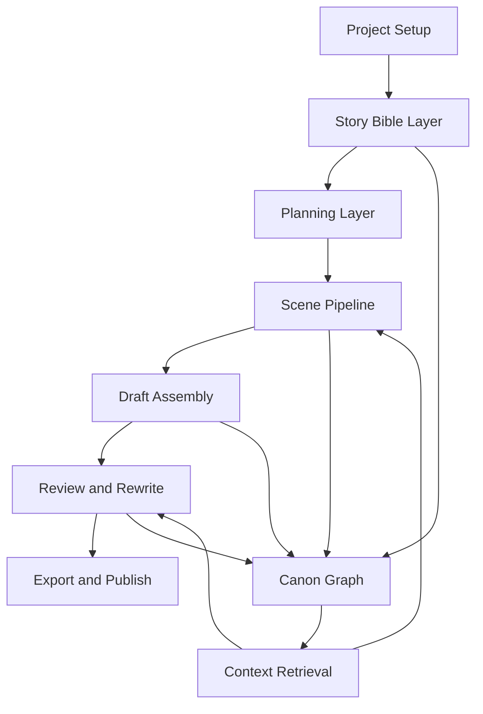

# GitHub 开源小说框架调研与长篇小说写作能力方案

更新时间：2026-03-18

## 1. 结论先行

如果目标不是做一个“会补全文本的聊天机器人”，而是做一个真正能支撑长篇小说生产的框架，那么现有 GitHub 开源项目给出的答案已经很清楚：

1. 纯编辑器路线已经很成熟，擅长资料管理、章节拆分、角色设定和导出，但几乎不具备强生成能力。
2. AI 写作路线已经出现不少可用项目，擅长从设定到章节、从章节到正文的流水线生成，但普遍缺少长篇一致性、全局改动传播和系统化评审。
3. 真正能支撑“长篇小说稳定生产”的核心，不是单个大模型，而是四件事：
   - 分层规划
   - 结构化上下文
   - 可追踪的 canon/设定管理
   - 多轮审校与重写机制

因此，我们要建设的不是单点“生成器”，而是一个 **长篇小说生产操作系统**：既能做故事规划，又能做章节生成、连载推进、全局修订、一致性检查和导出交付。

## 2. 调研范围与筛选口径

“GitHub 上所有小说开源框架”在字面上无法完全穷尽，因为大量仓库实际上是：

- 小说阅读器或爬虫
- 视觉小说引擎
- 仅做 prompt 集合的 demo
- 与小说创作弱相关的文本工具

本次调研采用的口径是：

1. 以“小说创作”或“长篇叙事生成”为核心目标。
2. 优先纳入仍可访问、定位明确、结构有参考价值的开源仓库。
3. 按四类归档：
   - 传统小说写作器
   - AI 小说生成框架
   - 叙事研究/评测框架
   - 可借鉴但不直接适合作为底座的相邻项目

## 3. GitHub 代表性开源框架盘点

### 3.1 传统小说写作器与结构化编辑器

这些项目不一定“会写”，但它们在长篇小说的信息架构上非常成熟，值得直接借鉴。

| 项目 | 仓库 | 主要定位 | 借鉴价值 | 备注 |
| --- | --- | --- | --- | --- |
| novelWriter | <https://github.com/vkbo/novelWriter> | 开源长篇写作器，面向小说项目管理 | 文稿拆分、章节树、注释、交叉引用、纯文本存储 | Stars 约 2.8k，发布活跃 |
| Manuskript | <https://github.com/olivierkes/manuskript> | 开源小说写作 IDE | premise -> summary -> outline -> characters 的完整结构流程 | Stars 约 2.2k，经典 Scrivener 替代品 |
| bibisco | <https://github.com/andreafeccomandi/bibisco> | 小说规划与人物塑造工具 | 人物深描、fabula、场景、叙事线 | 社区版开源，偏“写前规划” |
| novelibre | <https://github.com/peter88213/novelibre> | 轻量长篇写作/重构工具 | 情节线、章节摘要、项目可维护性 | 适合借鉴工程化存储 |
| mdnovel | <https://github.com/peter88213/mdnovel> | Markdown 小说项目管理 | 纯文本与元数据结合 | 适合本地优先、Git 协作 |
| mawejs | <https://github.com/mkoskim/mawejs> | 面向小说作者的项目工具 | 同时支持 architect/gardener/plantser 工作方式 | 对不同作者创作模式支持较好 |
| Weave | <https://github.com/mdegans/weave> | 交互式文本树/分支写作工具 | 分支草稿和变体管理 | 可借鉴“多版本探索” |

#### 这一类项目的共同优点

1. 把小说拆成可管理的小单元，而不是一个大文档。
2. 高度重视人物、地点、设定、情节线等“写作资产”。
3. 支持作者反复重构，而不是一次生成。
4. 大量采用本地文件和透明格式，便于版本控制。

#### 这一类项目的共同缺点

1. AI 生成能力弱，更多是“写作环境”而不是“写作引擎”。
2. 一旦进入 50 章、100 章以上，自动一致性检查仍不足。
3. 缺少针对 LLM 的上下文检索和结构化输出约束。

### 3.2 AI 小说生成框架与生成型工作流

这一类项目直接面向“自动写小说”或“AI 共创长篇”。

| 项目 | 仓库 | 主要定位 | 借鉴价值 | 备注 |
| --- | --- | --- | --- | --- |
| Long-Novel-GPT | <https://github.com/MaoXiaoYuZ/Long-Novel-GPT> | 中文长篇小说生成器 | 大纲 -> 章节 -> 正文的层级扩写；支持导入已有作品、拆书、检索修改 | 中文场景最有参考价值，Stars 约 1k |
| 91Writing | <https://github.com/ponysb/91Writing> | 本地优先 AI 长文写作系统 | 设定、世界观、章节、统计、多人模型接入、前端产品化完整 | 中文产品形态较成熟，Stars 约 1.3k |
| NovelForge | <https://github.com/RhythmicWave/NovelForge> | AI 写作框架与卡片式工作台 | Pydantic/JSON Schema 结构化输出、上下文注入 DSL、Neo4j 知识图谱 | 设计先进，适合借鉴框架层 |
| GOAT-Storytelling-Agent | <https://github.com/rmusser01/GOAT-Storytelling-Agent> | 从书籍规格到情节、场景、正文的 agent 流程 | `book_spec -> plot_chapters -> plot_scenes -> write_scene` 非常清晰 | 多 agent 分层设计值得借鉴 |
| StoryCraftr | <https://github.com/raestrada/storycraftr> | CLI 式 AI 小说生成器 | 世界观、角色、章节、情节生成的命令化流程 | 适合做自动化流水线 |
| NovelGenerator | <https://github.com/KazKozDev/NovelGenerator> | 多智能体小说生成系统 | 结构化数据库、知识状态、多轮精修、导出 | 对“一致性和状态管理”有明确设计 |
| LibriScribe | <https://github.com/guerra2fernando/libriscribe> | 多 agent 图书生成系统 | 从概念到手稿的多阶段流水线 | 适合借鉴 agent 职责拆分 |
| EdwardAThomson/NovelWriter | <https://github.com/EdwardAThomson/NovelWriter> | 代理式长篇小说创作 | 章节生成 + 多层评审 + 质量分析 | 把 review 作为核心步骤，方向正确 |
| GPTAuthor | <https://github.com/dylanhogg/gptauthor> | CLI 生成长书初稿 | 先审批 synopsis，再逐章生成 | 人在回路的 checkpoint 设计值得保留 |
| novelai | <https://github.com/jacobbeasley/novelai> | 小说规划、场景生成和后处理 | outline/scene/audiobook 一体化 | 更像实用脚本集合 |
| AI Novel Prompter | <https://github.com/danielsobrado/ainovelprompter> | 小说 prompt 管理器 | 故事元素管理、MCP 集成、世界观辅助 | 适合做 prompt 层产品能力 |
| book-os | <https://github.com/forsonny/book-os> | 小说/手稿标准与工作流系统 | 用标准、手稿、上下文层叠构建写作系统 | 对“分层上下文”很有启发 |
| pulpgen | <https://github.com/pulpgen-dev/pulpgen> | 自动把想法生成完整初稿 | idea -> first draft 的高速流水线 | 适合做 MVP 级别快速试写 |

#### 这一类项目的共同优点

1. 已经普遍接受“先规划、再扩写”的分层流程。
2. 越成熟的项目，越重视结构化中间产物，而不是直接出正文。
3. 多数项目都在尝试把人物、世界观和章节规划纳入统一上下文。
4. 一些先进项目已经引入知识图谱、结构化 schema 和卡片式工作流。

#### 这一类项目的共同缺点

1. 大多数项目在 30 章之后开始出现人物漂移、设定遗忘、时间线冲突。
2. 全局改动的传播能力弱。例如人物改名、设定调整后，往往只能人工回改。
3. 很多项目只有生成链，没有严谨的审校链。
4. 向量检索常被过度依赖，但对时间线、因果链和角色状态变化支持不足。
5. 多数项目缺少“连载模式”和“超长篇模式”的成本控制。

### 3.3 叙事研究、评测与结构化知识项目

这一类项目不是直接给作者写稿，但它们解决的是更底层的问题：如何让长叙事更稳定。

| 项目 | 仓库 | 主要定位 | 借鉴价值 | 备注 |
| --- | --- | --- | --- | --- |
| tell_me_a_story / Agents' Room | <https://github.com/google-deepmind/tell_me_a_story> | 长故事生成研究与评测 | 多角色 agent 协作、分阶段叙事生成、长文本评测 | 更像研究框架，不是产品 |
| Fabula | <https://github.com/davecarver/fabula> | 从文学文本中抽取知识图谱 | 实体识别、指代消解、情节事实抽取 | 非常适合做 canon 提取层 |
| MM-StoryAgent | <https://github.com/dwlmt/MM-StoryAgent> | 多模态长故事 agent | 场景规划、角色一致性、多模态扩展 | 对未来 IP 化有启发 |
| SEED-Story | <https://github.com/X-PLUG/SEED-Story> | 长篇多模态故事生成 | 分阶段故事合成与一致性 | 偏研究验证 |
| storyteller | <https://github.com/consunet/storyteller> | 多模态故事生成框架 | 结构化故事组件 | 可借鉴模块边界设计 |

#### 这一类项目最值得学什么

1. 评测不是可选项，必须内建。
2. 长篇叙事需要显式状态，而不是只靠 prompt。
3. “故事事实”应该被抽取成可计算对象，而不是永远埋在正文里。

### 3.4 相邻但不适合作为主体底座的项目

这类项目可能有局部价值，但不能直接代表“长篇小说框架”。

1. 视觉小说引擎，如 ink、Twine、WebGAL，擅长分支叙事，但不适合作为线性长篇小说生产底座。
2. 小说阅读器、爬虫、翻译项目，更多是消费链路，不是创作链路。
3. 单纯 prompt 模板仓库，缺少状态、流程和工程化能力。

## 4. 关键结论：现有开源生态的能力地图

### 4.1 已经被证明可行的能力

从现有仓库看，下面这些能力已经被广泛证明“该这么做”：

1. **分层规划**
   - idea
   - premise
   - book spec
   - acts
   - chapters
   - scenes
   - prose

2. **结构化故事资产**
   - 人物卡
   - 世界观
   - 地点
   - 阵营
   - 线索
   - 未回收伏笔
   - 主题与风格约束

3. **小单元写作**
   - 先 scene card，再写 scene draft
   - 先 chapter goal，再写 chapter body

4. **人在回路**
   - 关键阶段要求作者确认
   - 例如：定题、定人设、定卷纲、定章纲

5. **多轮改写**
   - 初稿
   - 连贯性修订
   - 风格修订
   - 信息密度修订

### 4.2 开源项目普遍没有真正解决的问题

下面这些问题，是我们方案必须正面解决的。

1. **超长篇一致性**
   - 不是 5 章、10 章，而是 100 章、300 章后的稳定性。

2. **全局变更传播**
   - 修改人物设定、世界规则、时间顺序后，受影响章节必须自动识别并进入重写队列。

3. **显式时间线**
   - 绝大部分项目对“事件发生在什么时候”管理很弱。

4. **角色状态机**
   - 角色知道什么、不知道什么、当前情绪、伤病、立场变化，很少有系统做成可检索状态。

5. **中文长篇网文特化**
   - 节奏、钩子、爽点、反转、章节结尾留悬念、连载发布频率，开源框架普遍没有针对性优化。

6. **质量评估闭环**
   - 很多项目“能生成”，但没有客观审查指标，也没有回归测试。

## 5. 我们应该借鉴什么，不应该借鉴什么

### 5.1 必须吸收的设计

1. **来自 novelWriter / Manuskript / bibisco**
   - 项目结构化管理
   - 章节/场景拆分
   - 角色与设定资产化

2. **来自 Long-Novel-GPT / GOAT / StoryCraftr**
   - 从全局到局部的规划流水线
   - 先有中间产物，再生成正文

3. **来自 NovelForge**
   - 结构化输出约束
   - 可声明的上下文注入
   - 图谱化知识管理

4. **来自 EdwardAThomson/NovelWriter / NovelGenerator**
   - 把审校和精修做成一等公民
   - 不把“第一次生成”当成结果

5. **来自 Fabula / tell_me_a_story**
   - 事实抽取
   - 状态追踪
   - 评估框架

### 5.2 不应该照搬的设计

1. **单次大 prompt 直接写完整章**
   - 这种方式短期看快，长期一定失控。

2. **只靠向量检索**
   - 向量适合召回，不适合维护规则和事实真值。

3. **多 agent 无限堆叠**
   - agent 太多会让系统成本高、延迟高、行为不可控。

4. **正文与设定混存、没有统一数据层**
   - 后续无法做影响分析和自动修订。

## 6. 面向长篇小说的完整框架方案

### 6.1 总体目标

构建一个支持以下能力的长篇小说框架：

1. 从零开始创建一部长篇小说项目。
2. 管理题材、风格、世界观、人物、主线、支线和伏笔。
3. 自动完成卷纲、章纲、场景卡和正文草稿生成。
4. 在长篇推进过程中保持设定一致、时间线一致、角色认知一致。
5. 支持人机共创、批量改写、局部重写和全局重构。
6. 最终输出 Markdown、DOCX、TXT、EPUB 等交付格式。

### 6.2 核心设计原则

1. **先结构，后正文**
   - 任何正文都必须有上游结构依据。

2. **canon 一等公民**
   - 世界规则、人物事实、时间线事件不能只存在于自然语言里。

3. **每一层都有产物**
   - 书籍规格、卷纲、章纲、场景卡、正文、评审报告都要落盘。

4. **生成和修订分离**
   - 生成器负责产出，编辑器负责纠偏，审校器负责发现问题。

5. **局部重写优先**
   - 尽量重写场景、章节，而不是整本重生成。

6. **人类在关键节点决策**
   - 尤其是题材定位、主角设定、核心冲突、阶段转折。

### 6.3 系统架构

### 6.4 六层能力模型

#### 第一层：项目与资产层

负责承载整个小说工程的数据骨架。

核心对象：

- `Project`
- `GenreProfile`
- `StyleGuide`
- `WorldRule`
- `Faction`
- `Character`
- `Relationship`
- `Location`
- `Artifact`
- `Thread`
- `ForeshadowingSeed`
- `TimelineEvent`
- `Arc`
- `Volume`
- `Chapter`
- `SceneCard`
- `SceneDraft`
- `CanonFact`
- `ReviewReport`
- `RewriteTask`

这一层借鉴：

- `novelWriter` 的项目拆分
- `bibisco` 的角色/设定管理
- `NovelForge` 的卡片式知识组织

#### 第二层：规划层

负责把模糊创意转成严格的长篇结构。

建议的规划链：

1. `Idea Intake`
2. `Premise`
3. `Book Spec`
4. `Theme and Promise`
5. `Core Cast`
6. `Act Plan`
7. `Volume Plan`
8. `Chapter Outline`
9. `Scene Card Plan`

每一层都使用结构化 JSON Schema 输出，禁止直接跳到正文。

每个中间对象至少包含：

- 目标
- 冲突
- 推进点
- 新信息
- 已知依赖
- 风格要求
- 风险提示

#### 第三层：记忆与检索层

这是长篇能力的核心，不解决这一层，后面都会失控。

采用 **混合记忆架构**：

1. **结构化事实库**
   - 记录人物年龄、阵营、秘密、伤病、装备、关系变化、已揭示信息。

2. **时间线索引**
   - 记录事件先后、持续时间、关联角色、影响章节。

3. **知识图谱**
   - 记录人物、地点、物件、势力、事件之间的关系。

4. **语义向量检索**
   - 用于召回相关文本片段，而不是承担事实真值。

5. **滚动摘要**
   - 每卷摘要
   - 每章摘要
   - 角色当前状态摘要
   - 未回收伏笔摘要

场景写作时的上下文装配必须分成三类：

1. **强制上下文**
   - 当前 scene card
   - 当前 chapter goal
   - 相关角色状态
   - 相关世界规则

2. **条件上下文**
   - 最近两场戏
   - 当前地点历史
   - 当前冲突相关线索

3. **压缩上下文**
   - 本卷至今摘要
   - 主线推进摘要

#### 第四层：生成与修订层

建议只保留少量高价值角色，而不是堆十几个 agent。

推荐 7 个工作角色：

1. **Story Architect**
   - 负责主题、卖点、长线结构、卷纲。

2. **Canon Keeper**
   - 负责设定真值、时间线、人物状态一致性。

3. **Chapter Planner**
   - 负责把卷纲拆成章纲。

4. **Scene Planner**
   - 负责把章纲拆成 scene card。

5. **Scene Writer**
   - 负责单场景正文生成。

6. **Continuity Editor**
   - 负责找出逻辑冲突、重复信息和节奏问题。

7. **Style Editor**
   - 负责语感、叙述口吻、信息密度和节奏修订。

每个角色都只吃自己需要的上下文，不能全量读整本书。

#### 第五层：评审与质量层

这一层决定系统是不是“能写长篇”，而不是“偶尔写出一章”。

必须内建三类检查：

1. **规则检查**
   - 角色名字漂移
   - 年龄/关系冲突
   - 时间线矛盾
   - POV 混乱
   - 章节长度异常
   - 违禁词/禁写规则

2. **模型评审**
   - 场景目标是否清晰
   - 冲突是否成立
   - 情绪推进是否有效
   - 本章是否有推进
   - 结尾钩子是否成立

3. **全局书稿分析**
   - 伏笔回收率
   - 支线遗失率
   - 设定污染率
   - 章节功能分布
   - 爽点/反转/信息揭示节奏

#### 第六层：作者工作台与导出层

这不是附属功能，而是生产效率核心。

推荐工作台至少包含：

1. 故事总览面板
2. 世界观与人物卡管理
3. 卷纲/章纲/场景卡看板
4. 正文编辑器
5. 时间线视图
6. 关系图视图
7. 变更影响面板
8. 审校报告面板
9. 导出中心

## 7. 关键能力：长篇小说真正需要的工作流

### 7.1 从零开始创建小说

1. 输入题材、目标读者、期望篇幅、风格样例、核心卖点。
2. 生成并确认 `Book Spec`。
3. 生成人物组、世界观规则和核心冲突。
4. 输出三幕或多卷结构。
5. 逐层拆到章纲和 scene card。

### 7.2 按章节稳定生产

每章流程固定化：

1. 章目标确认
2. 相关设定与人物状态检索
3. scene card 生成
4. scene draft 逐场生成
5. chapter assemble
6. 连贯性审校
7. 风格修订
8. canon 回写
9. 摘要更新

### 7.3 全局设定变更传播

这是大多数开源项目缺失、但我们必须做的能力。

当作者修改任一核心对象时，例如：

- 主角姓氏变化
- 世界规则变化
- 某角色提前知晓秘密
- 某事件发生时间改变

系统应自动执行：

1. 找出受影响的 `CanonFact`
2. 找出受影响的 `SceneCard`
3. 找出受影响的 `SceneDraft`
4. 生成 `RewriteTask`
5. 提示作者确认批量改写范围
6. 局部重写并重新跑审校

### 7.4 连载模式

如果目标包含网文连载，还需要额外能力：

1. 章节钩子强度评估
2. 上章 recap 压缩生成
3. 连载节奏控制
4. 日更/周更任务队列
5. 读者反馈标签回流

## 8. 推荐的数据模型

### 8.1 核心实体

| 实体 | 关键字段 |
| --- | --- |
| Project | title, genre, audience, target_words, status |
| StyleGuide | pov, tense, tone, sentence_style, taboo_rules |
| Character | role, goal, fear, secret, arc_state, knowledge_state |
| Location | type, rules, atmosphere, related_events |
| Thread | setup, payoff_target, status, related_chapters |
| TimelineEvent | when, participants, consequence, source_scene |
| Chapter | objective, conflict, reveal, hook, summary |
| SceneCard | purpose, pov, participants, location, entry_state, exit_state |
| SceneDraft | text, references, continuity_flags |
| CanonFact | subject, predicate, value, confidence, source_refs, valid_range |
| ReviewReport | scope, findings, severity, action_items |
| RewriteTask | trigger, impacted_nodes, rewrite_strategy, status |

### 8.2 一个重要原则

`knowledge_state` 和 `arc_state` 必须显式建模。

也就是说，系统要知道：

1. 这个角色知道哪些秘密。
2. 这个角色误以为自己知道什么。
3. 这个角色当前对谁信任。
4. 这个角色此刻的身体和心理状态。
5. 这个角色在弧线上的位置。

没有这一层，长篇人物就一定会漂。

## 9. 推荐技术实现

### 9.1 技术路线建议

建议采用 **PostgreSQL-first + 结构化数据 + 版本化正文 + 可插拔模型** 的实现方式。

推荐组合：

1. **主数据库**
   - PostgreSQL 16+ 作为唯一主数据库
   - 正文、结构化数据、工作流状态、审校报告统一入库

2. **检索层**
   - 优先使用 PostgreSQL 内的 `pgvector`
   - 配合结构过滤和词法检索做混合召回

3. **导出层**
   - Markdown / DOCX / EPUB / PDF 作为衍生产物
   - 本地目录或对象存储均可，但不再作为真值源

4. **后端服务**
   - Python + FastAPI + Pydantic + SQLAlchemy + Alembic

5. **任务编排**
   - 以数据库驱动的 workflow engine 为主
   - 先用 PostgreSQL 队列表实现可恢复 worker，不急于引入重型调度框架

6. **前端**
   - Web 工作台优先
   - 后续可封装桌面端

### 9.2 为什么这样选

1. 小说正文虽然可导出成文件，但“版本化正文 + 审校 + 重写 + 回写”更适合数据库事务模型。
2. 设定、事实、时间线、重写任务天然适合结构化数据库统一承载。
3. `pgvector` 能把语义检索和业务过滤放到同一数据库里，降低一致性复杂度。
4. JSON Schema/Pydantic 最适合约束中间产物。
5. 过早引入 Neo4j、分布式队列和复杂多 agent 编排，会拖慢第一版落地。

## 10. 分阶段落地计划

### Phase 1：小说工程底座

目标：先把“项目能管住”做出来。

交付：

1. 项目结构
2. 章节/场景/角色/设定的基础模型
3. PostgreSQL 主存储
4. 基础编辑与导出

### Phase 2：规划流水线

目标：先能从创意稳定走到章纲。

交付：

1. Book Spec 生成
2. 人物与世界观生成
3. 卷纲/章纲生成
4. Scene Card 生成
5. 人工确认 checkpoint

### Phase 3：正文生产流水线

目标：让系统能持续写，而不是只写一章。

交付：

1. Scene Draft 生成
2. Chapter Assemble
3. 章节摘要与卷摘要自动更新
4. 相关设定自动回写

### Phase 4：一致性与重写引擎

目标：把长篇稳定性做出来。

交付：

1. CanonFact 抽取与更新
2. TimelineEvent 跟踪
3. RewriteTask 自动生成
4. 影响面分析
5. 批量局部重写

### Phase 5：评审与连载增强

目标：让系统从“能写”变成“可持续生产”。

交付：

1. 连贯性检查器
2. 风格检查器
3. 章节钩子评估
4. 连载模式任务编排
5. 质量看板

## 11. MVP 边界建议

第一版不要贪大，MVP 只做以下闭环：

1. 创建小说项目
2. 生成 Book Spec
3. 生成人物与世界观
4. 生成 20-50 章章纲
5. 逐章拆 scene card
6. 逐场写正文
7. 自动更新摘要和人物状态
8. 基础一致性检查
9. 支持改设定后的局部重写

如果这 9 项能跑通，系统已经明显超过大多数 GitHub 开源项目。

## 12. 我对最终产品形态的建议

不要把这个项目定义成：

- 一个 prompt 集合
- 一个一键写书按钮
- 一个单纯的富文本编辑器

应该把它定义成：

**“一个面向长篇小说生产的人机共创框架”**

它的护城河不在“某个模型更会写”，而在：

1. 对长篇结构的工程化管理
2. 对 canon 和时间线的显式建模
3. 对变更传播和局部重写的支持
4. 对中文长篇/网文写作场景的专项优化

## 13. 最终建议：我们的参考组合

如果只保留最值得借鉴的几个样本，我建议按下面这个组合作为蓝本：

1. **项目与文稿组织**：`novelWriter` + `Manuskript`
2. **中文长篇生成流程**：`Long-Novel-GPT` + `91Writing`
3. **结构化框架设计**：`NovelForge`
4. **分层 agent 流程**：`GOAT-Storytelling-Agent`
5. **评审与精修**：`EdwardAThomson/NovelWriter` + `NovelGenerator`
6. **事实抽取与一致性**：`Fabula` + `tell_me_a_story`

换句话说，我们的最佳路线不是复制某一个仓库，而是把它们各自做对的部分组合起来，形成一个真正面向长篇小说的生产系统。

## 14. 建议的下一步

如果继续推进，我建议立刻进入三个具体动作：

1. 先定义项目数据模型和目录结构。
2. 先实现 `Book Spec -> Chapter Outline -> Scene Card` 的结构化流水线。
3. 同步设计 `CanonFact + TimelineEvent + RewriteTask`，不要等正文写多了再补。

这三个动作做对，后面的生成质量才有根。
