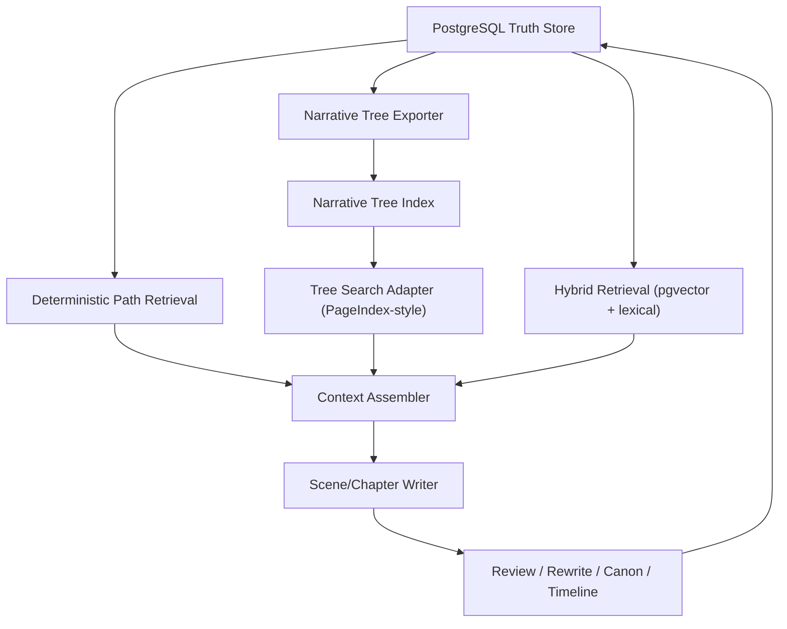

# BestSeller x PageIndex 集成评估与叙事架构路线

**日期**: 2026-03-20  
**状态**: Design Decision Record

## 1. 结论

`PageIndex` 可以融入当前系统，但不应该作为主数据库、主工作流引擎或唯一检索层。

更合适的定位是：

1. 借用它的核心思想：`层级树索引 + 推理式检索`
2. 在 BestSeller 中实现 `Narrative Tree Index`
3. 保留 PostgreSQL 作为唯一真值源
4. 把 PageIndex 风格检索放到 `context assembler` 中，作为结构化路径检索之后、向量检索之前的第二层

换句话说：

- **应该借用**: “目录层级/树索引/树搜索”的方法论
- **不应该替换**: `PostgreSQL + CanonFact + TimelineEvent + WorkflowState`

## 2. PageIndex 提供了什么

我核查的是 GitHub 上的 [VectifyAI/PageIndex](https://github.com/VectifyAI/PageIndex)。

截至 2026-03-20，这个项目公开强调的能力是：

- 面向长文档的 `vectorless, reasoning-based RAG`
- 先生成文档层级树，再做树搜索
- 支持 PDF 和 Markdown 输入
- 强调“不要 chunk，不要 vector DB，优先使用文档原生结构”

这套思路对于“长篇小说上下文装配”非常有价值，因为小说并不只是语义相似检索问题，而是：

- 当前卷
- 当前章
- 当前场
- 当前人物知识边界
- 当前明线/暗线/感情线节点
- 当前尚未回收的伏笔

这些都更适合“结构化树搜索”，而不是纯向量召回。

## 3. 当前系统和 PageIndex 的关系

### 3.1 当前系统已经有的基础

BestSeller 当前已经有这些结构化对象：

- `book_spec`
- `world_spec`
- `cast_spec`
- `volume_plan`
- `chapter_outline_batch`
- `WorldRule`
- `Location`
- `Faction`
- `Character`
- `Relationship`
- `CharacterStateSnapshot`
- `CanonFact`
- `TimelineEvent`

并且这些对象都存 PostgreSQL，而不是散落文件。

这意味着 BestSeller 和 PageIndex 的起点不一样：

- PageIndex 解决的是“长文档如何先变成可搜索树”
- BestSeller 解决的是“小说生成中的结构化真值、状态推进和修订闭环”

所以我们不需要把 PageIndex 整套搬进来做主内核。

### 3.2 当前系统还缺什么

当前系统缺的不是“再来一个检索器”，而是**更明确的叙事控制对象**：

- `PlotArc`
- `ArcBeat`
- `ClueLedger`
- `PayoffLedger`
- `RomanceArc`
- `AntagonistPlan`
- `ThemeTrack`
- `ReaderPromise`

也就是说，PageIndex 不是直接解决“好小说”的答案。  
它只能帮助我们更好地**组织和取回**这些叙事对象。

## 4. 推荐的集成方式

## 4.1 不推荐的方式

以下方式不建议采用：

1. 把 PageIndex 当成主存储
2. 用 PageIndex 替换 PostgreSQL
3. 用 PageIndex 取代 `CanonFact / TimelineEvent / CharacterStateSnapshot`
4. 只做 PageIndex，不补叙事图谱

原因很简单：  
PageIndex 解决的是“树化检索”，不是“小说状态管理”。

## 4.2 推荐的方式

推荐做成三层上下文系统：

### 第一层：Deterministic Path Retrieval

先按确定性路径取上下文，不做模糊搜索：

- `/book/premise`
- `/book/promise`
- `/world/rules`
- `/characters/protagonist`
- `/arcs/main_plot`
- `/arcs/romance`
- `/volumes/01`
- `/chapters/012`
- `/scenes/012-03`

这一层应该由 BestSeller 自己实现，直接读 PostgreSQL 中的结构化对象。

### 第二层：PageIndex-style Tree Search

对这些结构化对象导出一份“叙事树文档”：

- Story Bible 文档
- Arc Graph 文档
- Volume Grid 文档
- Chapter Contract 文档
- Clue/Payoff Ledger 文档

然后对这份树做推理式检索，用来补充：

- 哪条暗线和当前场景最相关
- 哪个伏笔在这一场应该被回收
- 哪个角色关系张力需要被推进

这层适合引入 PageIndex 思想，甚至做 PageIndex adapter。

### 第三层：Hybrid Retrieval

最后再用当前已有的 `pgvector + lexical + structural` 混合检索去召回：

- 最近正文片段
- 相关 scene summary
- 近似语义历史场景

这一层是补充，不是主控制器。

## 5. 建议的新架构

核心原则：

- PostgreSQL 是真值
- Narrative Tree 是结构化投影
- Tree Search 是上下文增强
- pgvector 是兜底补充

## 6. 需要补的新领域对象

如果目标是写“更完整、可读、可冲榜”的小说，必须把下面这些对象做成显式模型。

### 6.1 PlotArc

用于表示：

- 明线
- 暗线
- 感情线
- 成长线
- 复仇线
- 阵营线
- 悬疑线

建议字段：

- `arc_code`
- `arc_type`
- `title`
- `promise`
- `core_question`
- `start_state`
- `target_payoff`
- `priority`
- `status`

### 6.2 ArcBeat

用于表示某条线在卷/章/场的推进节点。

建议字段：

- `plot_arc_id`
- `scope_type` (`volume/chapter/scene`)
- `scope_ref_id`
- `beat_type`
- `expected_change`
- `actual_change`
- `resolved`

### 6.3 ClueLedger / PayoffLedger

用于管理：

- 线索何时埋下
- 谁知道
- 何时应回收
- 当前是否超期未回收

### 6.4 RomanceArc / EmotionTrack

用于显式管理感情线和情绪推进，而不是只靠人物关系文本描述。

建议字段：

- `pairing`
- `stage`
- `trust_level`
- `distance_level`
- `desire_gap`
- `last_shift_chapter_no`
- `next_expected_shift`

### 6.5 AntagonistPlan

用于让反派不是“静态设定”，而是持续推进的动态对手。

建议字段：

- `goal`
- `current_plan`
- `next_countermove`
- `pressure_level`
- `known_by_protagonist`

## 7. 为什么这套会比单纯 RAG 更适合小说

小说不是“问答检索”。

小说写作更像：

- 计划推进
- 状态推进
- 信息控制
- 情绪控制
- 伏笔控制
- 节奏控制

所以真正重要的是：

- 当前该推进哪条线
- 当前不该泄露哪条线
- 当前这场应该回收什么
- 当前人物知道什么、不知道什么
- 当前卷的承诺有没有兑现

这些都需要“叙事状态机”和“叙事图谱”，而不是只做语义召回。

## 8. 最终建议

最终建议是：

1. **不直接把 PageIndex 作为核心依赖**
2. **先在 BestSeller 内部补 Narrative Graph**
3. **再实现 Narrative Tree Exporter**
4. **最后做 PageIndex-style Tree Search Adapter**

这样做的好处：

- 不破坏当前 PostgreSQL-first 架构
- 不引入第二套真值源
- 能把 PageIndex 的长处用于“树化叙事检索”
- 不会误把检索问题当成叙事问题

## 9. 下一阶段开发目标

下一阶段不再优先堆 prompt，而是优先这三项：

1. `Narrative Graph` 数据模型
2. `Narrative Tree` 导出与路径检索
3. `Context Assembler v2`

这三项做完，系统才真正接近“可以稳定产出完整长篇”的架构。
