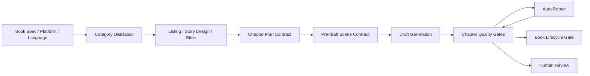

# 质量门禁与人工复核系统性归因分析

Generated at: `2026-05-19`

## 0. 结论摘要

当前多本书反复触发质量门禁和人工复核，不是单纯因为“门禁太严”，而是三个问题叠加：

1. **部分门禁本身存在误判**：英文项目被中文字符统计和中文节奏检测器审计，导致 `char_count=0`、`word_count underflow`、`pulse_count=0` 这类假阳性，继而批量生成无效修复任务。
2. **真正的问题发生在前置框架层**：早期设定、listing、story bible、章纲、旧 canon 污染没有在写作前被硬阻断，导致错误进入章节生成，再由后置门禁反复拦截。
3. **修复闭环缺少统一归因事件层**：门禁、自动修复、人工复核在多个模块里各自写状态，缺少统一的 failure event taxonomy，导致同一根因会以不同名义反复触发。

因此优化方向不是降低质量线，而是把“错误设置、错误素材、错误合同、错误检测器”前置拦截，并把真实内容缺陷和检测误判分开处理。

---

## 1. 本次分析范围与证据

分析对象覆盖：

- `output/*/audits/quality-retrofit/*.csv` 与 summary。
- `output/*/audits/lifecycle-quality/report.json`。
- `data/legacy_book_quality_closure/fleet_report.json`。
- `data/framework_self_closure/framework_self_closure_report.json`。
- 关键服务代码：`quality_levers`、`autonomous_book_repair`、`pipelines`、`quality_levers_retrofit_audit`。
- 历史驳回与修复材料：`output/exorcist-detective-1778051012/*`、`output/exorcist-detective-1778428166/audits/*`。

核心数据现状：

| 指标 | 结果 | 含义 |
| --- | ---: | --- |
| retrofit 审计章节数 | `2543` | 覆盖多本存量书 |
| `high + critical` | `1922 / 2543 = 75.6%` | 后置门禁高压状态 |
| `flat_narration` | `1692` | 节奏/段落锚点问题或检测误判 |
| `weak_attraction` | `1641` | 吸引力/pulse 指标问题或检测误判 |
| `weak_prose` | `876` | 文风、抽象表达、AI 味问题 |
| `ai_voice` | `504` | 模式化表达残留 |

生命周期报告显示，除个别短项目外，多数书还存在 `book_incomplete`、`repair_tasks_remaining`、`length_stability_below_bar`、`whole_book_acceptance_not_passed` 等问题。这说明后置门禁并非单点问题，而是贯穿“源设定 -> 章节生成 -> 修复 -> 全书验收”的系统性问题。

---

## 2. 目标架构视角

理想闭环应该是：



当前问题在于：

- `A-D` 的源头合同没有全部硬阻断。
- `G-H` 的后置门禁和自动修复强度更高。
- 一旦错误从 `C/D` 进入 `F`，后面只能反复“修章节”，而无法修掉“错误框架”。

所以架构原则应调整为：

> 任何能够在框架层判断的失败，不允许拖到章节层再修；任何能够在机器侧判定为误判的失败，不允许进入人工复核队列。

---

## 3. 根因归类

### R1. 英文项目被中文检测器误判，制造大量假阳性

优先级：`P0`

证据：

- `src/bestseller/services/quality_levers/detectors.py` 的 `evaluate_word_count` 基于 `count_cjk_chars(text)`。
- `compute_pulse_density` 也以 CJK 字符数作为分母。
- `src/bestseller/services/quality_levers/rhythm_engineering.py` 的节奏检查同样依赖 CJK 字符长度。
- `scripts/quality_levers_retrofit_audit.py` 调用 `audit_chapter(text, platform=platform)`，没有传入 `language`。
- 英文项目如 `romantasy-1776330993`、`superhero-fiction-*` 的章节文件实际是英文 prose，但 retrofit CSV 中出现 `char_count=0`、`underflow: 0 < 1800`、`pulse_count=0`。

影响：

- 英文书被批量判成 `high`，尤其是 `flat_narration` 和 `weak_attraction`。
- 这些错误任务进入修复队列后，会消耗自动修复轮次和人工复核预算。
- 团队会误以为“英文书内容普遍严重不过关”，实际第一层先是检测器适配错误。

修复原则：

- 英文书在语言感知审计完成前，不应再用 CJK-only quality_levers 生成 hard repair tasks。
- 旧的英文 retrofit 结果需要标记为 `invalid_audit_language_mismatch`，不要直接作为人工复核依据。

### R2. 自动修复指令层硬编码中文约束

优先级：`P0`

证据：

- `src/bestseller/services/autonomous_book_repair.py` 中修复长度 band 使用 `language="zh-CN"`。
- 修复指令文本为中文，并默认中文网文表达约束。

影响：

- 英文项目即使被送入修复，也会拿到不匹配的修复要求。
- 修复输出可能进一步偏离目标语言、平台和读者预期，形成“越修越触发门禁”的循环。

修复原则：

- 修复 prompt 必须从 project metadata 读取 `language`、`platform`、`category`、`target_word_band`。
- 如果语言未知，应进入 `metadata_missing` 的前置阻断，而不是默认中文。

### R3. 早期框架资产污染没有被前置硬阻断

优先级：`P0/P1`

证据：

- `output/exorcist-detective-1778051012/commercial-repair-plan.md` 明确记录两层污染：
  - writing-before planning pollution：listing、story-bible、rules 中残留旧游戏/无限流词汇。
  - canon promotion gap：第 8 章后旧世界观回流，废弃设定和关系被再次提升为 canon。
- `output/exorcist-detective-1778051012/rejected-drafts/README.md` 将 8-32 章归档为 non-canon，原因包括旧设定回流、类型漂移、状态回滚、过早暴露终局信息。
- `output/exorcist-detective-1778051012/editor-rejection-audit-20260509.md` 指出 commercial gate package 曾 `PASS score=100`，但 L8 scorecard 仍低至 `quality_score=49.92`，说明旧门禁只证明“锚点存在”，没有证明“读者体验成立”。

影响：

- 后续章节不是单章失误，而是被错误源材料持续污染。
- 自动修复如果只改章节，不回滚 listing/story bible/canon，会反复失败。

修复原则：

- 章节修复前必须先跑 `Source Artifact Audit`，检查旧设定、废弃人物、禁用术语、平台/题材漂移。
- 对已确认污染的批次，应先冻结 canon promotion，再重建干净 planning package。

### R4. 前置合同偏 warn，后置门禁偏 hard block

优先级：`P1`

证据：

- `config/default.yaml` 中已有 `enable_prewrite_readiness_gate`、`story_design`、`reverse_outline_gate` 等能力。
- 但关键项仍存在非阻断配置，例如 `prewrite_readiness_block_on_failure: false`、`reverse_outline_gate_block_on_failure: false`、`methodology_contract_mode: warn`。
- 与此同时，`src/bestseller/services/pipelines.py` 中章节质量、Bible gate、AI flavor gate、auto repair exhausted 等都会走到 `waiting_human_review` 或 `requires_human_review=True`。

影响：

- 系统允许弱规划进入写作，但不允许弱章节通过验收。
- 结果是问题在最贵的阶段暴露：已经生成多章后才反复被挡。

修复原则：

- 对新项目和高风险存量项目，前置合同应从 `warn` 升级为 `block` 或 `block_on_critical`。
- 对老项目保留 migration override，但必须标注为 `legacy_risk_accepted`，避免误以为框架已闭环。

### R5. 框架自闭环多数仍依赖 generic fallback

优先级：`P1`

证据：

- `data/framework_self_closure/framework_self_closure_report.json` 显示 12 个 category 全部是 `repairable`。
- `distillation status counts` 为 `generic_fallback: 11`、`category_specific: 1`。
- `otherworld-cross-system` 虽是 category-specific，但 maturity 为低位。

影响：

- 框架看起来“可运行”，但类别级源材料不足。
- 当项目进入具体赛道时，规划层可能缺少差异化机制，导致章节靠通用模板补位，进而触发 `weak_attraction`、`flat_narration`、`type_drift`。

修复原则：

- category-specific distillation 不是 P2 美化项，而是降低前置设定错误率的基础设施。
- 但它可以排在语言误判和源污染修复之后推进。

### R6. 质量失败事件没有统一建模

优先级：`P1`

证据：

- 人工复核触发点分散在 pipeline 多处：
  - scene rewrite stall / max scene revisions。
  - auto repair exhausted。
  - L2 bible gate violation。
  - AI flavor gate residual block。
  - chapter review max revisions。
  - blocked production state after rewrite gate。
- 不同触发点写入的 metadata 名称和上下文不一致。

影响：

- 无法稳定回答“这次人工复核是否由同一个根因重复触发”。
- 无法区分 `detector_false_positive`、`source_contract_failure`、`draft_quality_failure`、`repair_loop_exhausted`。
- 复盘容易停留在单章修补，而不是定位到 framework 设置或门禁适配。

修复原则：

- 引入统一的 `QualityFailureEvent`，让所有门禁和修复模块写同一种事件。
- 后续 dashboard、排查、自动路由都从这个事件表派生。

### R7. 中文存量书确实存在真实内容质量问题

优先级：`P1`

证据：

- 中文项目中 `weak_prose`、`ai_voice`、`flat_narration`、`weak_attraction` 大量出现。
- lifecycle 报告显示部分项目 `length_cv` 偏高，章节长度不稳定。
- volume audit 中部分书有 power drift、death/resurrection 反复等长程问题。

影响：

- 即使修掉检测误判，中文书仍然需要系统性修复。
- 如果只调低阈值，会把真实读者体验问题放过去。

修复原则：

- 中文书按 Pareto 修：先处理覆盖最多章节的 2-3 个 failure code。
- 对长程问题按卷修，而不是逐章孤立修。

---

## 4. 系统性排查方案

### Step 1. 建立全书级问题台账

对每本书生成统一 inventory：

| 字段 | 来源 | 用途 |
| --- | --- | --- |
| `slug` | output 目录 | 主键 |
| `language/platform/category` | project metadata / config | 判断检测器和阈值 |
| `chapter_count` | drafts / lifecycle report | 判断完整性 |
| `gate_failure_counts` | retrofit CSV | 识别高频 failure code |
| `human_review_count` | workflow / project metadata | 识别复核压力 |
| `repair_task_count` | lifecycle report | 识别修复积压 |
| `source_artifact_risk` | listing/bible/outline audit | 判断是否先修框架 |
| `audit_validity` | language-aware audit check | 判断是否误判 |

第一轮输出不要直接进入修复，而是先分类：

- `A: detector_false_positive`
- `B: source_contract_failure`
- `C: draft_quality_failure`
- `D: lifecycle_completion_failure`
- `E: repair_loop_design_failure`

### Step 2. 追溯每个失败到“最早可预防阶段”

每条 failure event 必须补齐：

```json
{
  "slug": "book-slug",
  "chapter": 12,
  "stage": "chapter_quality_gate",
  "gate_id": "quality_levers.word_count",
  "code": "word_count_underflow",
  "severity": "high",
  "language": "en-US",
  "platform": "tomato",
  "source_stage": "detector",
  "preventable_stage": "metadata_validation",
  "remediation_class": "fix_detector_not_chapter",
  "evidence_ref": "output/.../quality-retrofit/window.csv",
  "human_review_reason": null
}
```

关键不是记录“哪里失败”，而是记录“哪里本该提前拦住”。

### Step 3. 审计框架源资产

每本问题书在继续自动修章节前，先检查：

- listing 是否包含旧题材词、旧玩法词、废弃人物。
- story bible 是否存在 canon regression。
- chapter outline 是否和当前位置 profile 匹配。
- platform profile 是否和目标语言/平台一致。
- book spec 是否缺少 `language`、`category_key`、`word_target`。
- prompt constructor 是否把 legacy rules 混入新任务。

判定规则：

- 若源资产污染，先修源资产，不允许直接批量修章节。
- 若只存在章节 prose 问题，才进入 surgical patch。

### Step 4. 审计门禁正确性

每个 gate 需要标注适用域：

| gate | 适用语言 | 适用平台 | hard block 条件 | fallback |
| --- | --- | --- | --- | --- |
| CJK word count | `zh-CN` | qimao/tomato-cn | language is CJK | 英文转 English word count |
| pulse density | language-specific | language-specific | detector available | unknown 时 warn，不生成 repair task |
| rhythm engineering | language-specific | language-specific | detector available | unknown 时跳过或降级 |
| banned AI patterns | language-specific | all | pattern pack exists | 缺 pattern pack 时只记录 |

门禁不能只问“是否失败”，还要先问“该门禁是否适用于这本书”。

### Step 5. 审计修复循环

对每个修复任务记录：

- 是否来自有效 gate。
- 是否重复命中同一 code。
- 是否跨过最大自动修复轮次。
- 修复后是否改善同一指标。
- 是否引入新的 source/canon 问题。

连续两轮同 code 不改善时，不应继续让 LLM 改同一章，而应升级为：

- detector calibration。
- source artifact repair。
- gate threshold review。
- human review with structured evidence。

### Step 6. 建立全局指标

最低需要以下指标：

| 指标 | 目标 |
| --- | --- |
| `first_pass_gate_pass_rate` | 衡量前置框架是否有效 |
| `human_review_trigger_rate` | 衡量人工复核压力 |
| `avg_repair_rounds_per_chapter` | 衡量修复效率 |
| `same_code_repeat_rate` | 衡量是否反复卡同一问题 |
| `detector_false_positive_rate` | 衡量门禁适配质量 |
| `source_stage_prevention_rate` | 衡量问题是否前置解决 |
| `book_lifecycle_pass_rate` | 衡量全书闭环 |

---

## 5. 修复与优化方案

### P0. 先止血：阻断误判和错误修复

1. **为 quality_levers 加语言感知层**
   - 在 project metadata 中读取或推断 `language`。
   - `audit_chapter`、`audit_rhythm`、`audit_emotion_labels` 增加 language 参数。
   - 英文项目使用 English word count、English rhythm/pacing、English AI-pattern pack。
   - 语言未知时，不允许生成 hard repair task。

2. **隔离已有英文误判任务**
   - 对 `romantasy-1776330993`、`superhero-fiction-*` 的旧 retrofit 结果标记为 invalid。
   - 暂停这些任务进入人工复核。
   - 重新跑 language-aware audit 后再判断真实问题。

3. **修复自动修复指令语言**
   - `autonomous_book_repair` 从 book/project metadata 读取语言。
   - 移除默认 `language="zh-CN"` 的全局假设。
   - 修复 prompt 按 language/platform/category 选择 instruction pack。

4. **建立 `QualityFailureEvent`**
   - 所有 gate、repair、human review 统一写事件。
   - 必须包含 `source_stage`、`preventable_stage`、`remediation_class`。
   - 先不要求做完整 dashboard，但要先统一数据结构。

验收标准：

- 英文项目不再出现 `char_count=0` 却触发中文 word-count hard failure。
- 英文旧误判不再计入人工复核压力。
- 同一章节连续两轮无改善时，系统能说清楚是 detector、source 还是 draft 问题。

### P1. 把框架问题前置硬阻断

1. **Prewrite readiness 从 warn 改为 staged block**
   - 新项目：`block_on_failure`。
   - 存量高风险项目：`block_on_critical`。
   - 老项目：允许 override，但写入 `legacy_risk_accepted`。

2. **Source Artifact Audit 成为批次写作前置步骤**
   - 检查 listing/story bible/chapter outlines 是否包含旧设定污染。
   - 检查 canon promotion 是否把废弃设定重新提升。
   - 检查 platform/language/category 是否一致。

3. **Batch Promotion Gate**
   - 每个新批次写作前验证上一批次 canon state。
   - 禁止旧 worldview、旧角色关系、旧机制名回流。
   - 禁止在未过全书规划检查时继续批量生成。

4. **失败码归因到责任层**
   - `word_count_underflow` 可能属于 detector、platform profile、draft length 三类，不允许只标 `weak_attraction`。
   - `flat_narration` 需要区分 rhythm detector 不适配、chapter plan 缺 scene beats、writer prose 执行弱。

验收标准：

- 新项目的错误语言/平台/题材配置在第 0 章前失败。
- 章节级人工复核中，由 source pollution 引起的占比明显下降。
- 同一 source defect 不会在 10+ 章里重复出现。

### P1/P2. 补齐类别闭环

1. **补齐 category-specific distillation**
   - 先处理当前高频项目类别：suspense-mystery、female-growth-ncp、action-progression、science-fiction-progression、relationship-driven。
   - 每个类别都需要 own aggregate，而不是 generic fallback。

2. **把类别机制接入 planning gate**
   - category card 不只是 prompt 素材，还要参与 story design gate。
   - 如果类别核心机制缺失，不允许进入章节生成。

验收标准：

- framework self-closure 中 `generic_fallback` 从 `11` 降到可控范围。
- category-specific project 的 story bible 不再只呈现通用套路。

### P2. 提升读者体验型门禁

1. **黄金三章使用 multi-persona critique**
   - `peer_author`、`platform_editor`、`target_reader` 分开打分。
   - 不再只看锚点是否存在，而要看前 800 字吸引力、章末拉力、冲突递进。

2. **引入 chapter position profile**
   - 开篇、承接、转折、高潮、收束章节使用不同指标。
   - 避免所有章节被同一节奏模板审计。

3. **把修复策略从逐章升级为卷级**
   - 对 power drift、death/resurrection、length instability 等长程问题，按卷规划修复。
   - 不允许单章修补破坏长程状态。

验收标准：

- 黄金三章人工驳回率下降。
- 卷级 lifecycle gate pass rate 上升。
- 修复后不会引入新的 canon regression。

---

## 6. 每本书的初步处置建议

| 项目 | 初判类型 | 建议动作 |
| --- | --- | --- |
| `romantasy-1776330993` | 语言检测误判 + 可能存在真实长程问题 | 先重跑 English-aware audit；旧 `high=413` 不作为修复依据 |
| `superhero-fiction-1776147970` | 语言检测误判 + volume power drift 待复核 | 先隔离旧 retrofit，再做英文节奏和长程状态审计 |
| `superhero-fiction-1776301343` | 语言检测误判 + volume power drift 待复核 | 同上 |
| `exorcist-detective-1778051012` | 源资产污染 + canon promotion gap | 先修 listing/story bible/canon，再修章节 |
| `exorcist-detective-1778428166` | 已有修复成果，但仍有 prose/attraction 问题 | 作为中文改良样板，跑新 failure event 归因 |
| `female-no-cp-1776303225` | 真实内容质量 + 长度稳定性问题 | 按 `weak_prose`、`ai_voice`、`weak_attraction` 做 Pareto 修复 |
| `xianxia-upgrade-1776137730` | 真实内容质量 + 长程状态问题 | 先修卷级状态和长度，再修 prose |
| `human-nature-game-1779104692` | 最接近完整闭环的试点 | 先清掉 3 个 repair tasks，作为 lifecycle closure 验证样板 |

---

## 7. 推荐执行顺序

### 第 1 周：止血和校准

1. 加 `language-aware quality audit`。
2. 隔离英文项目旧误判任务。
3. 修复 `autonomous_book_repair` 的语言硬编码。
4. 引入最小版 `QualityFailureEvent`。

### 第 2 周：前置阻断

1. Source Artifact Audit 接入批次生成前。
2. Prewrite readiness 对新项目启用 `block_on_failure`。
3. 对 `exorcist-detective-1778051012` 做源资产重建试点。
4. 对 `human-nature-game-1779104692` 做 lifecycle closure 试点。

### 第 3-4 周：规模化优化

1. 中文大书按 Pareto failure code 修复。
2. 长程问题按卷修复。
3. category-specific distillation 补齐高频类别。
4. 建 dashboard：人工复核率、重复失败码、修复轮次、前置拦截率。

---

## 8. 不建议做的事

- 不建议全局降低质量门禁阈值。这样会掩盖真实 prose、吸引力、canon 漂移问题。
- 不建议直接批量重写所有 high 章节。当前 high 中混有大量检测误判，先重写会浪费成本。
- 不建议继续让人工复核承接所有 max-retry。人工复核前必须给出结构化 failure event 和最早可预防阶段。
- 不建议只修章节文本，不修 listing/story bible/canon。源污染存在时，单章修复会反复回流。

---

## 9. 成功标准

短期：

- 英文项目旧误判清零或被隔离。
- 人工复核队列中 `detector_false_positive` 占比显著下降。
- `same_code_repeat_rate` 可观测。

中期：

- 新项目第 0 章前完成 language/platform/category/source contract 校验。
- 章节平均自动修复轮次下降。
- 同一 source defect 不再跨多章重复出现。

长期：

- `first_pass_gate_pass_rate` 上升。
- `book_lifecycle_pass_rate` 上升。
- 人工复核从“兜底修错”变为“处理少量真正需要判断的编辑问题”。
