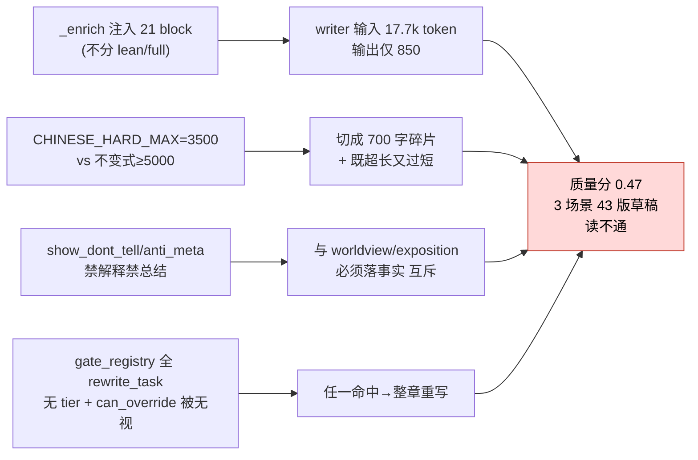
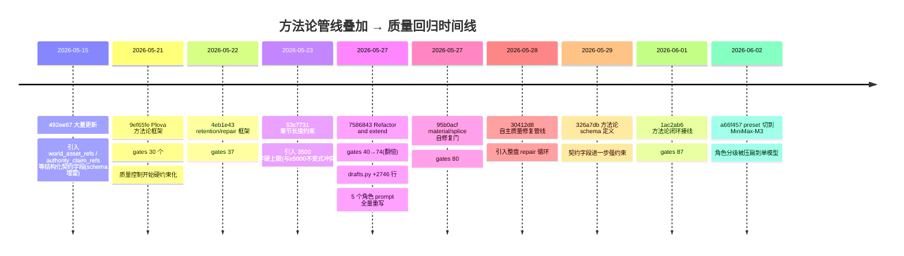
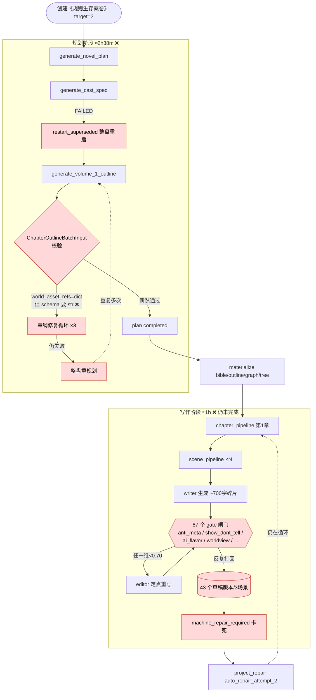
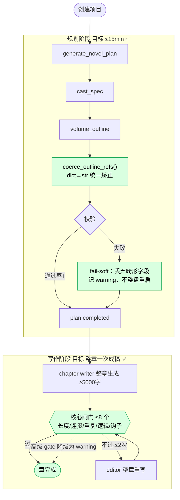

# 《规则生存案卷》生成链路诊断与修复方案

> 诊断对象：项目 `819abda4-81ac-4258-bfe9-d72271211d38`（《规则生存案卷》，target_chapters=2）
> 诊断时间：2026-06-02 19:4x（书仍卡在第 1 章 `drafting`）
> 证据来源：PostgreSQL `workflow_runs` / `workflow_step_runs` / `llm_runs` / `quality_scores` / `scene_draft_versions` 实跑数据 + 源码 + git 历史

> **本报告焦点（按用户要求收窄）**：质量为何变差，是最近哪次框架改动引入的——从框架层面归因。见 **§A 框架级回归归因** 与 **§B 代码级深挖**（核心）。下方 §1–§6 为支撑证据与修复方案。

---

## B. 代码级深挖（最近改动到底把什么改坏了）

> §A 指出"哪个提交"，本节给出"哪一段代码、怎么坏的"，全部为源码 + 实测 token 佐证。

### B.1 写作上下文过载：21 个 guardrail block 恒定注入，喂 1.7 万 token 只吐 850

- `drafts.py::_enrich_chapter_first_context`（7202+）向 writer 上下文包**无条件注入 21 个独立指令块**：
  `canon_guardrails / chapter_length / chapter_market_constraints / character_role / decision_policy / dialogue_voice / entry_registry / entry_state_ledger / entry_system / exposition_density / faction_ecology / hook_echo / prior_persona_feedback / progression / relationship_agency / rule_system / scene_beat / scene_coherence / signature_scene / timeline_canon / voice_dna`。
- 该函数**不区分 `lean`/`full` 模式**（函数签名只接 project/chapter/packet，无 mode 判断）。所以 `lean_writer_prompt=true`（config:118，本意是瘦身）**根本没削减这 21 块**。
- 实测（本书 writer 调用）：**平均输入 17,761 token / 平均输出 850 token / 最大输入 19,021**。即：**喂 21 块、1.7 万 token 指令，只产出 ~600 字。**
- 机理：弱模型在 21 个互相独立、部分互斥的指令块前**无法分辨主次**，退化为表面模式匹配 → 出"看似合规、读着空"的通用句；又因输出被 3500 字硬顶（见 B.2），只能切成 700 字碎片 → 拼接断裂。**这是"读不通"的代码级根因。**

### B.2 字数契约在代码里写死矛盾（M1 的实锤）

- `length_stability_gate.py:71-72`：
  ```python
  CHINESE_CHAPTER_HARD_MIN_WORDS = 1800
  CHINESE_CHAPTER_HARD_MAX_WORDS = 3500
  ```
- `drafts.py::_chapter_length_contract_band`（7172-7174）把中文章节**强制 clamp 到 [1800, 3500]**，注释（7275-7276）明说"clamped to the 1800-3500 zh ceiling"，并据此生成喂给 writer 的 `chapter_length_block`。
- 而 skill 不变式（`invariants.md`）写明**每章 ≥5000 字、低于即强制 rewrite**。
- 后果：runtime 让模型写 ≤3500、orchestration 层判 <5000 要返工——**同一章被两套契约判为"既超长又过短"，任何产出都过不了，必然进入返工死循环。**

### B.3 闸门互斥 + 无分层（M3 的实锤）

**(a) 三类闸门方向相反，却都对同一段 ≤3500 字硬约束：**

| 闸门 | 代码 | 要求 writer | 方向 |
|------|------|-----------|------|
| `show_dont_tell_gate` | 4 条正则（如 `(他\|她)…(知道\|明白\|意识到)…(但\|却\|所以)`、情绪命名、能力总结） | **禁止**讲动机/命名情绪/总结能力 | 去解释 |
| `anti_meta_gate` | `HARD_META_TERMS`→`severity="block"`；`_SUMMARY_ENDING_RE`/`_REVEAL_ENDING_RE` | **禁止**元叙述、禁止总结式/点破式结尾 | 去概括 |
| `worldview_progression_gate` / `exposition_density_gate` | `_check_authority_ladder`/`_check_reveal_distribution`，要求每卷/章落 authority、reveal、world_asset | **必须**落世界观/规则/权柄事实 | 要解释 |

> writer 同时被命令"只准展示、不准解释、不准点破、不准总结"**和**"本章必须落 N 条世界规则/权柄/揭示"。在 3500 字内这是**不可调和约束**。M3 修一处坏一处 → 分数卡 0.47 → 触发 43 版重写。

**(b) `gate_registry.py` 没有 tier 概念，几乎全是 `rewrite_task`：**
- 注册的 15 个门里，`ai_flavor_gate`/`anti_meta_gate`/`show_dont_tell_gate`/`material_advancement_gate`/`signature_audit_gate`… 全是 `repair_strategy="rewrite_task"`，**任一命中即触发整章重写**，无 core/advanced 之分。

**(c) 设计意图与接线自相矛盾：**
- `show_dont_tell_gate.py:69` 明确把 issue 标 `severity="medium"`、`can_override=True`（作者本意是"建议"）；
- 但 `pipelines.py:6974-7001` 走 `_prose_cfg.show_dont_tell_severity == "block"` 把它升级为**硬阻断 + 写 `blocked_by_show_dont_tell_gate`**。
- 即：一段正常的"陆岑知道门不能开，但…"会被一条粗正则判定为"动机解释"→ 触发整章返工。**作者标了 can_override，配置却让它 block——这是最近 prose-gate 接线引入的回归。**

### B.4 schema 容错缺失（M2 的实锤）

- `planner.py:1406` 对**原始模型输出**直接 `ChapterOutlineBatchInput.model_validate(...)`，未先矫正 `world_asset_refs`/`authority_claim_refs`。
- 同文件其它构建路径（7350/10204）有 `_string_list()` 矫正，但 volume-outline 失败路径**没接上** → dict 进 `list[str]` schema → 5 条校验错 → 修复×3 → 整盘重启。

### B.5 小结：质量回归的代码级因果链



---

## A. 框架级回归归因（核心结论）

> 一句话：**质量崩塌不是模型变笨，而是过去 12 天（2026-05-21 → 06-02）往框架上焊了一整套"方法论驱动质量管线"，其复杂度远超所选模型（MiniMax-M3）能稳定满足的程度。**

### A.1 改动体量：12 天 +20 万行

```
git diff 9ef65fe~1 .. HEAD  →  718 files changed, +203,683 / -2,384
```

这不是迭代，是**在生产链路上做了一次大规模架构叠加**，且边加边在同一本书上跑。三条主线同时膨胀：



### A.2 三个"框架级矛盾"——质量差的真正机理

最近的改动制造了三处**自相矛盾的硬约束**。模型不是写不好，是被夹在互斥的契约中间，怎么写都过不了门，于是被反复重写到坍塌。

| 矛盾 | 一方 | 另一方 | 引入提交 | 对质量的破坏 |
|------|------|--------|---------|------------|
| **M1 字数契约打架** | `config/default.yaml:120-134`：每章**硬上限 3500 字、绝不超过**，"3 个场景不得超 3500" | skill 不变式 `invariants.md`：**每章 ≥5000 字**，低于即强制 rewrite | 53c7731（05-23） | 章被切成 ≤700 字小场景拼接 → 段落断裂、读不通(R4)；同一章同时"超长"(config门)又"过短"(不变式) → **必然触发 gate 冲突 → 死循环重写** |
| **M2 schema 类型打架** | prompt 让模型把 `world_asset_refs`/`authority_claim_refs` 当**资产对象**输出 `list[dict]` | `domain/workflow.py:475-476` 声明 `list[str]` | 492ee67→7586843 | 章纲校验必失败 → 修复×3 → 整盘重规划 → 规划耗时 2.6h(R2) |
| **M3 闸门目标打架** | `anti_meta_gate`(删元叙述)、`exposition_density_gate`(压信息) | `show_dont_tell_gate`(要展示展开)、`worldview_progression_gate`(要塞世界观字段) | 7586843/95b0acf/1ac2ab6 | 87 个 gate 对同一段 700 字提互斥要求 → 弱模型修一处坏一处 → 3 场景 43 版草稿、分数卡 0.47 永不过线(R3) |

### A.3 谁是"质量差"的第一责任提交

按对**质量**（而非速度）的破坏力排序：

1. **53c7731（05-23，章节长度约束）** — 引入 3500 硬上限，与 ≥5000 不变式正面冲突，是"碎片化 + 读不通"的框架级源头，也是 length gate 与不变式互锁的根。
2. **7586843（05-27，Refactor and extend）** — 单提交把 gate 从 40 → 74、drafts.py +2746 行、5 个角色 prompt 全量重写、workflow.py +153 行塞进契约字段。**这是质量回归的"奇点提交"**：prompt 过载 + 闸门翻倍 + 契约强约束三连击。
3. **9ef65fe / 1ac2ab6（方法论框架 + 闭环）** — 把"质量控制"从"打分建议"升级为"硬性闸门 + 闭环修复"，使任何不达标都触发重写循环，弱模型进入无法收敛的返工。
4. **a66f457（06-02，preset→M3）** — 不是首因，但**移除了唯一能勉强扛住上述复杂度的强模型档位**（planner 本应 Opus），把矛盾彻底引爆。

> **结论**：质量变差 = `章节长度契约自相矛盾(53c7731)` × `奇点提交把闸门/契约/prompt 三重过载(7586843)` × `方法论闭环强制返工(9ef65fe/1ac2ab6)` × `模型档位下调移除安全垫(a66f457)`。**前三项是框架自伤，第四项是放大器。** 即使换回强模型，M1/M2/M3 三个矛盾不解，质量依旧上不去。

### A.4 框架层面的修复方向（与 §5 工程方案对应）

1. **消除字数契约矛盾**（对应 M1）：config 3500 上限与 ≥5000 不变式二选一统一；短书建议"整章一次成稿 ≥5000"，废除"3 场景拼 ≤3500"。
2. **schema 自愈**（对应 M2）：契约字段加 `field_validator(mode=before)` dict→str；校验失败 fail-soft 不整盘重启。
3. **闸门分层去冲突**（对应 M3）：`gate_registry.py` 标 `tier=core|advanced`，core ≤8 个硬门，其余降 warning；互斥门（anti_meta vs show_dont_tell）不得同时为硬门。
4. **契约/prompt 瘦身**：把 worldview/methodology 每章必填字段降为可选；回滚 7586843 对 writer prompt 的过载部分（drafts.py 上下文裁剪）。

---

## 0. TL;DR（结论先行）

这本 **2 章** 的验证书，从创建到现在跑了 **3.93 小时**，烧掉 **168 次 LLM 调用 / 161 分钟纯模型时间**，到现在**第 1 章都没写完**、第 2 章还没开始。质量分 0.47–0.56，远低于 0.70 门槛。

问题不是"模型变笨了"，而是 **4 个叠加的系统性回归**：

| # | 根因 | 直接后果 | 严重度 |
|---|------|---------|--------|
| **R1** | 角色分级被 `minimax` preset 整体压扁到单一 `MiniMax-M3` | planner 本该用 Opus 做强推理，现在用中端模型 → 产出畸形 JSON | P0 |
| **R2** | 大纲 schema 新增字段 `world_asset_refs`/`authority_claim_refs` 声明为 `list[str]`，但模型按 prompt 输出 `list[dict]`，且失败路径**没做类型矫正** | 章纲校验连续失败 → 3 次修复仍失败 → **整盘重规划**，反复数次，吃掉 ~1.5h | P0 |
| **R3** | 质量闸门膨胀到 **87 个 gate 模块**，scene pipeline 引用 gate **332 处** | 3 个场景被反复打回，产生 **43 个草稿版本**（≈14×返工），仍只拿 0.47 分 | P0 |
| **R4** | 弱模型 + 超大上下文（writer 单次输入 ~17k token，输出仅 ~920 token） | 场景被切成 700 字碎片再拼接，全局逻辑断裂、读不通 | P1 |

**核心判断**：最近的"方法论框架整合"（worldview / methodology / 多 gate）把**规划契约和质量闸门的复杂度，加到了远超当前所选模型（M3）能稳定满足的程度**。结果是：规划阶段卡在 schema 校验死循环，写作阶段卡在 gate 返工死循环。

---

## 1. 实跑时间线（证据）

```
15:46  创建项目，generate_novel_plan 启动
  │
  ├─ 15:46→16:24 (38min) generate_cast_spec ......................... FAILED
  ├─ 16:24→16:45 (21min) restart_superseded（整盘重启）............... FAILED
  ├─ 16:42→17:34 (52min) generate_volume_1_outline ................... FAILED  ← schema 校验失败×3
  ├─ 17:06→17:34 (28min) generate_volume_1_outline（再重启）.......... FAILED
  ├─ 17:15→17:34 (19min) generate_volume_1_outline（再重启）.......... FAILED
  ├─ 17:35  project_repair / materialize_story_bible ................. 反复
  ├─ 17:54→18:05  多次 cancelled（single_worker_validation_reset 等）
  ├─ 18:05→18:24 (19min) generate_novel_plan ........................ ✅ 终于 completed
  │
18:24  规划总耗时 ≈ 2小时38分钟（仅为 2 章！）
  │
18:24→18:28  materialize chapter_outline / narrative_graph / tree ... ✅
  │
18:28  project_pipeline / chapter_pipeline 启动
  ├─ 18:28→19:21  第1章 10 个 scene_pipeline 轮次（每轮 2–7min）
  ├─ 19:21  chapter_pipeline → machine_blocked / machine_repair_required
  ├─ 19:21→19:39  project_repair → chapter_auto_repair_attempt_2（还在跑）
  │
19:41  仍停在第 1 章 drafting，第 2 章 planned（未动）
```

**LLM 调用分布（按角色）：**

| 角色 | 模型 | 调用数 | 输入 tok | 输出 tok | 总耗时 | 均耗时 |
|------|------|-------|---------|---------|-------|-------|
| planner | **MiniMax-M3** | 45 | 303,691 | 146,614 | **99 min** | 132s/次 |
| writer | MiniMax-M3 | 27 | 466,268 | 24,867 | 24 min | 54s/次 |
| critic | MiniMax-M3 | 54 | 315,595 | 21,621 | 22 min | 24s/次 |
| editor | MiniMax-M3 | 26 | 376,607 | 24,760 | 14 min | 32s/次 |
| summarizer | MiniMax-M3 | 16 | 24,159 | 1,960 | 2 min | 8s/次 |

> 注意三件事：① **5 个角色全是 MiniMax-M3**（角色分级失效）；② planner 45 次调用、99 分钟——为 2 章规划做了 45 次推理；③ writer 单次输入 1.7 万 token、输出仅 920 token——**喂得多、吐得少**。

---

## 2. 当前链路全景图（含问题标注）



**两个死循环（红色）是全部痛点的来源：**
1. **规划死循环**：`schema 校验失败 → 修复×3 → 整盘重启`
2. **写作死循环**：`生成 → 87 gate 打回 → 重写 → 再打回`

---

## 3. 根因深挖

### R1 · 角色分级被压扁到单模型（P0）

设计意图（`config/default.yaml` + architecture.md）是**分级路由**：

| 角色 | 设计模型 | 温度 | 用途 |
|------|---------|------|------|
| planner | claude-**opus**-4-5 | 0.82 | 强推理、多候选 |
| writer | claude-**sonnet**-4-5 | 0.85 | 正文 |
| critic | claude-**haiku**-4-5 | 0.25 | 确定性打分 |
| editor | claude-sonnet-4-5 | 0.40 | 定点重写 |

但 `BESTSELLER_LLM_PROVIDER=minimax` 这个 preset（`settings.py:562`）把**全部 5 个角色覆盖成 `openai/MiniMax-M3`**。后果：

- **planner 用中端模型做最难的结构化推理** → 产出不合 schema 的 JSON（见 R2）。
- **critic 用 M3 而非 haiku** → 24s/次、打分非确定性，54 次调用还摇摆。
- 用户反馈"以前用更差的 MiniMax 也没这么烂"——印证：**模型不是唯一变量**，是"模型能力"与"R2/R3 新增的契约/闸门复杂度"之间的**鸿沟**被拉大了。

### R2 · 章纲 schema 类型不匹配 → 校验死循环（P0，最致命）

实跑报错（`generate_volume_1_outline` step）：

```
5 validation errors for ChapterOutlineBatchInput
chapters.0.world_asset_refs.0
  Input should be a valid string [input_value={'asset_key': 'toll-const...'}, input_type=dict]
chapters.0.authority_claim_refs.0
  Input should be a valid string [input_value={'claim_key': 'register-h...'}, input_type=dict]
...
```

- Schema 声明（`domain/workflow.py:475-476`）：
  ```python
  world_asset_refs: list[str] = Field(default_factory=list)
  authority_claim_refs: list[str] = Field(default_factory=list)
  ```
- 但 planner prompt（`planner.py:11395 / 11809`）要求模型为每章输出 `world_asset_refs`、`authority_claim_refs` 等**结构化进度字段**，模型自然按"资产对象"理解，吐出 `{'asset_key': ..., 'note': ...}` 这样的 **dict**。
- 关键缺陷：失败路径 `planner.py:1406` 直接对**原始模型输出**做 `ChapterOutlineBatchInput.model_validate(...)`，**没有先把这两个字段 dict→str 矫正**。而其它构建路径（`planner.py:7350 / 10204`）是有 `_string_list()` 矫正的——**矫正逻辑覆盖不全**。
- 于是：校验失败 → 触发"章纲修复循环 ×3"→ 让同一个 M3 重吐，它还是吐 dict → 3 次全失败 → **整盘重规划** → 又花 20–50 分钟。这一条贡献了规划阶段的绝大部分耗时。

### R3 · 质量闸门膨胀（P0）

- `src/bestseller/services/` 下有 **87 个 `*gate*` 模块**（总 372 个 service 模块），`pipelines.py` 引用 "gate" **332 次**。
- 实跑证据：第 1 章只有 **3 个场景**，却产生了 **43 个 scene_draft_versions**（≈14× 返工）；rewrite_tasks：completed 26 / cancelled 12 / pending 4。
- 质量分（`quality_scores`，is_current）：

  | target | overall | goal | conflict | emotion | dialogue | style | hook |
  |--------|--------|------|----------|---------|----------|-------|------|
  | scene_card | 0.47–0.49 | 1.00 | 0.65–0.75 | 0.44 | 0.62–0.84 | 0.82 | **0.36** |
  | project | 0.56 | 0.50 | 1.00 | 0.60 | 0.39 | 0.53 | **0.00** |

- 多个 gate **互相拉扯**：`anti_meta_gate`（删元叙述）、`show_dont_tell_gate`（要展示）、`ai_flavor`（去 AI 味）、`exposition_density_gate`（控信息密度）同时对一段 700 字的碎片提要求，弱模型每修一处就破坏另一处 → 分数在 0.47 附近震荡、永远过不了 0.70 → 反复返工直到 `machine_repair_required` 卡死。

### R4 · 上下文超载 + 碎片化写作（P1）

- writer 单次**输入 ~17k token、输出 ~920 token**（≈600–700 中文字）。`lean_writer_prompt: true` 已开，但上下文仍然过大。
- 框架要求"每章 ≥5000 字"，但实际是把章拆成多个 700 字小场景，**分别生成再拼接**。弱模型 + 每段独立上下文 → **段落间逻辑/语气断裂**，这正是用户说的"读不通、逻辑不清晰"。
- 抽样正文（第1章场景）句子层面其实尚可（氛围、悬念在线），但**碎片拼接 + 反复重写覆盖**导致全局不连贯；另外通篇用 `ta` 中性代词，是弱模型的偷懒默认，不符合中文网文习惯。

---

## 4. 目标链路图（修复后）



**三条结构性改变：**
1. 规划：**类型矫正统一前置** + 校验**fail-soft**（畸形字段降级丢弃，不再整盘重启）。
2. 角色：planner / critic 至少恢复到能稳定产出结构化 JSON 的模型档位。
3. 写作：**整章一次成稿**取代碎片拼接；闸门**分层**——核心 ≤8 个硬门，其余降级为 warning。

---

## 5. 修复方案（按优先级）

### P0-1 修复章纲类型矫正（直接干掉规划死循环）
- **位置**：`src/bestseller/services/planner.py:1406` 之前。
- **做法**：在 `model_validate` 前对 `vol_chapters` 每章统一跑一个 `_coerce_outline_ref_fields()`，把 `world_asset_refs`/`authority_claim_refs`/`world_state_deltas` 等字段里出现的 dict 用现成的 `_string_list()`/取 `asset_key`/`claim_key` 折叠成 str。
- **加固**：给 `ChapterOutlineBatchInput` 这两个字段加 Pydantic `field_validator(mode="before")`，dict→`str(dict['asset_key'])`，**让 schema 自身容错**，这样所有入口（含 `cli/main.py:3361`、`fanqie_short_planner.py:755`）一并受益。
- **验证**：用 R2 报错里那条 LLM run（`b37374ef-…`）的原始 payload 做单测，断言校验通过。

### P0-2 校验失败 fail-soft，禁止"整盘重启"
- **位置**：`generate_volume_1_outline` 的修复循环 / `restart_superseded` 触发逻辑。
- **做法**：章纲非关键字段（worldview 进度类）校验失败时，**丢弃该字段+记 warning** 继续，而不是 retry×3 后 `restart_superseded`。仅当**章数/标题/goal 等关键骨架**缺失才返工。

### P0-3 恢复角色分级（或至少给 planner/critic 配强档）
- **位置**：`.env`（`BESTSELLER_LLM_PROVIDER`）/ `settings.py:562` preset。
- **选项 A（推荐）**：planner / critic 用 Anthropic（opus/haiku），writer/editor 留 MiniMax-M3 控成本——做混合 preset。
- **选项 B**：若必须全 MiniMax，则**大幅简化 planner 的输出契约**（见 P0-4），让 M3 够得着。
- 需你拍板成本/供应商，见下方问题。

### P0-4 精简规划契约与闸门栈
- planner prompt 当前强制每章输出 `world_state_deltas / world_asset_refs / authority_claim_refs / world_scene_template_ref / reveal_weight / anti_copy_boundary_notes / map_function / asset_risk_escalation / reveal_budget …`——对 2 章验证书是巨大过载。
- **做法**：把这些 worldview 进度字段从"**每章必填硬约束**"降为"**可选、缺省自动补**"；按 target_chapters 分档（≤50 章不启用 worldview_expansion 全套）。
- **闸门分层**：在 `gate_registry.py` 里把 87 个 gate 标记 `tier=core|advanced`；core（长度/连贯/重复/逻辑/钩子/对白 ≤8 个）为硬门，advanced 一律降级为 warning，不触发 rewrite 死循环。

### P1-1 整章成稿替代碎片拼接
- **位置**：`drafts.py` / `pipelines.py` scene→chapter 装配。
- **做法**：对短书（≤50 章）走"writer 一次生成整章 ≥5000 字"，减少跨场景上下文丢失；保留场景卡作为大纲约束而非独立生成单元。

### P1-2 收敛护栏
- rewrite 最多 2 次且要求 ≥3% 提升（已有机制），但要确保**advanced gate 不参与触发**；连续 2 次不达标即 `accept_with_debt` 落库继续，不卡 `machine_repair_required`。

---

## 6. 验证计划

1. **单测先行（TDD）**：为 P0-1 写失败用例（dict refs）→ 修矫正 → 转绿；覆盖 `ChapterOutlineBatchInput` field_validator。
2. **离线重跑规划**：用同一 premise 重跑 `generate_novel_plan`，断言：规划 **≤15 分钟**、planner 调用 **≤10 次**、0 次 `restart_superseded`。
3. **重跑第 1 章**：断言整章 ≥5000 字、scene_draft_versions ≤ 场景数×3、overall ≥0.70。
4. **对照**：新建一本同设定 3 章书走修复后链路，与本书 3.93h/卡死 做 A/B。

---

## 7. 需你拍板的决策

1. **模型策略**：planner/critic 是否恢复 Anthropic 强档（贵但稳），还是全留 MiniMax-M3 + 简化契约（省但需大改 prompt）？
2. **worldview 方法论字段**：是否同意把它们从"每章硬约束"降为"可选"？这是最近整合进来的核心特性，降级会削弱"世界观推进闭环"，但它正是规划卡死的元凶。
3. 修复**这本书**（在途 repair）还是**新开一本验证**修复后链路？
