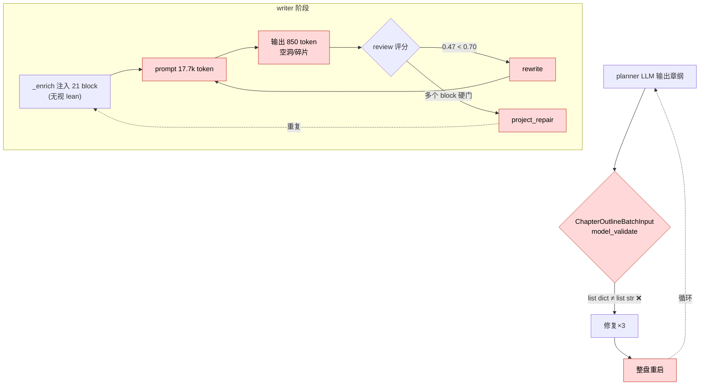
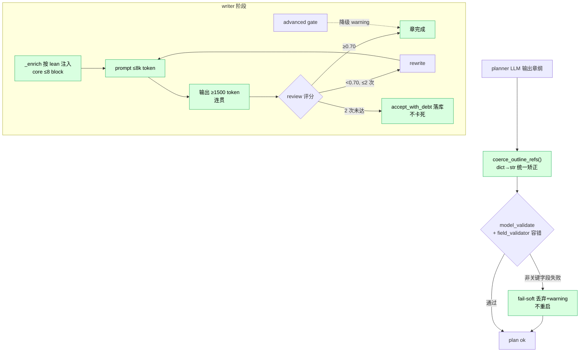
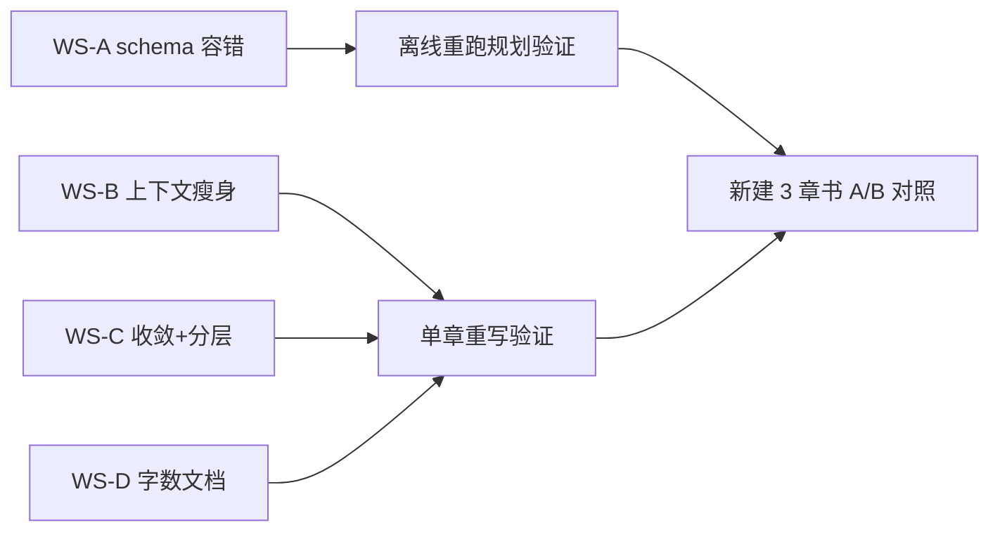

# 质量回归修复 · 开发计划

> 配套诊断报告：[规则生存案卷-生成链路诊断与修复方案-20260602.md](规则生存案卷-生成链路诊断与修复方案-20260602.md)
> 分支：`fix/quality-regression-pipeline`
> 模型策略（已拍板）：五角色全留 `MiniMax-M3`；修复方向是**降低框架对模型能力的要求**，而非换模型。

---

## 1. 背景（为什么要做这次修复）

过去 12 天（2026-05-21→06-02）框架叠加了一整套"方法论驱动质量管线"（+20 万行），导致：

- **规划极慢**：一本 2 章验证书规划耗时 2.6 小时，planner 调用 45 次、反复整盘重启。
- **正文读不通**：质量分 0.47（门槛 0.70），3 个场景产生 43 版草稿仍不收敛。

实测根因（代码级，详见诊断报告 §B），按对结果的影响力排序：

| 代号 | 根因 | 实测证据 | 主要损害 |
|------|------|---------|---------|
| **R-A** | 章纲 schema 类型不容错：模型输出 `list[dict]`，schema 要 `list[str]`，失败路径无矫正 | `planner.py:1406` 校验 5 错 → 修复×3 → 整盘重启 | **规划慢**（小时级） |
| **R-B** | writer 上下文过载：`_enrich_chapter_first_context` 无条件注入 **21 个指令块**，且**不分 lean/full** | writer 平均输入 **17,761 token / 输出仅 850** | **正文空洞/读不通** |
| **R-C** | 重写不收敛 + 闸门无分层：低分(0.47)触发重写，但重写仍喂同一过载 prompt；外层 repair 重复跑使单场景重写 ~14 次 | 3 场景 **43 版草稿** | **慢 + 质量不升** |
| **R-D** | 字数契约文档不一致：实际强制 1800-3500，但 `chapter_length_gate` docstring 与 skill 不变式写 ≥5000 | docstring vs 常量 | 文档误导（非死循环） |

> 关键判断：**R-B 是质量崩塌的中心**。过载 prompt 让弱模型产出"看似合规、读着空"的通用句 → 评分低 → 触发重写 → 重写仍喂过载 prompt → 永不收敛。修好 R-B，R-C 的churn 会大幅自愈。

---

## 2. 目标与非目标

**目标（本次交付）**
1. 规划阶段不再因 schema 类型问题整盘重启；规划时间从小时级降到 ≤15 分钟。
2. writer 上下文从 ~17.7k token 降到 ≤8k token（lean 模式真正生效），输出从 850 → ≥1500 token。
3. 重写/修复有硬收敛上限，单场景草稿版本数 ≤ 场景数×3。
4. 字数契约统一为单一事实源（1800/2600/3500），清除 5000 幽灵。

**非目标（本次不动）**
- 不换模型、不恢复 Anthropic 分级。
- 不重写方法论框架本身；只把"每章硬约束"降级为"可选/建议"。
- 不删除 87 个 gate 模块；只做**分层**（core 硬门 / advanced 降级 warning）。

---

## 3. 现状 vs 目标（架构图）

### 3.1 当前链路（问题）



### 3.2 目标链路（修复后）



---

## 4. 工作分解（WBS）与具体改动

### WS-A 修复章纲 schema 容错（R-A）— P0
**文件**：`src/bestseller/domain/workflow.py`、`src/bestseller/services/planner.py`
- A1. 给 `ChapterOutlineInput.world_asset_refs` / `authority_claim_refs` 加 `field_validator(mode="before")`：遇 dict 取 `asset_key`/`claim_key`/`ref`/`key`，否则 `str()`；遇 list 逐项折叠。让 schema 自愈，惠及所有入口（含 `cli/main.py:3361`、`fanqie_short_planner.py:755`）。
- A2. `planner.py:1406` 前对 `vol_chapters` 跑统一 `_coerce_outline_ref_fields()`（复用 A1 逻辑），双保险。
- A3. fail-soft：非关键字段（worldview 进度类）校验失败 → 记 warning 丢弃，不触发 `restart_superseded`；仅关键骨架（章数/标题/goal）缺失才返工。
- **测试**：用 R-A 报错的 dict 形态 payload 做单测，断言校验通过、字段被折叠为 str。

### WS-B writer 上下文瘦身（R-B）— P0（质量中心）
**文件**：`src/bestseller/services/drafts.py`
- B1. 让 `_enrich_chapter_first_context` 接收 `lean: bool`；lean 模式下只注入 **core 集合**（≤8 块）：`chapter_length / character_role / dialogue_voice / scene_beat / scene_coherence / canon_guardrails / timeline_canon / hook_echo`。其余 13 块（market_constraints / decision_policy / entry_* / faction_ecology / exposition_density / progression / relationship_agency / rule_system / signature_scene / voice_dna / prior_persona_feedback）lean 下不注入。
- B2. 渲染层对每个 block 做长度上限（如单块 ≤600 字），避免单块膨胀。
- B3. 验收：writer 实测输入 ≤8k token。
- **测试**：构造含全部 block 的 packet，断言 lean 渲染产物只含 core 8 块且总长受限。

### WS-C 重写收敛 + 闸门分层（R-C）— P0
**文件**：`src/bestseller/services/gate_registry.py`、`pipelines.py`、`repair.py`
- C1. `GateRegistration` 增 `tier: Literal["core","advanced"]`。core（长度/连贯/重复/因果/钩子/对白）保持 `rewrite_task`；advanced（signature_audit / material_advancement / ai_flavor 等）降为"记 warning，不触发 rewrite"。
- C2. 单场景/章重写硬上限：累计 ≤3 版；外层 `project_repair`/`chapter_auto_repair` 不得重置该计数；达上限 → `accept_with_debt` 落库继续，禁止 `machine_repair_required` 卡死。
- C3. `show_dont_tell` 已是 `warn`（确认无需改）；保留 `anti_meta`=block。
- **测试**：模拟连续低分，断言重写 ≤3 次后落 debt 且 workflow 不进入 blocked。

### WS-D 字数契约统一（R-D）— P1（文档/常量收敛）
**文件**：`chapter_length_gate.py`（docstring）、skill `invariants.md`、`SKILL.md`
- D1. 把 `chapter_length_gate.py` 顶部 docstring 的 3000/3500/5000 改为与常量一致的 1800/2600/3500。
- D2. 把 skill 不变式"每章 ≥5000 字"修正为"中文长篇每章 1800-3500 字（番茄/起点标准），低于 1800 或高于 3500 返工"，消除与 runtime 的冲突。
- **测试**：grep 断言代码中不再出现误导性 5000 字章节下限表述（人工核对）。

---

## 5. 执行顺序与依赖



1. **WS-A**（独立、TDD、最先做）→ 解决"规划小时级"。
2. **WS-B**（质量中心）→ 解决"读不通"。
3. **WS-C**（依赖 B 的低分下降）→ 解决 churn。
4. **WS-D**（独立、低风险）→ 文档收敛。

每步遵循 TDD：先写失败测试 → 实现 → 转绿 → `pytest` 局部回归。

---

## 6. 验收标准

| 指标 | 现状 | 目标 |
|------|------|------|
| 规划耗时（2-3 章书） | ~2.6h | ≤15min |
| planner 调用数 | 45 | ≤10 |
| `restart_superseded` 次数 | 多次 | 0 |
| writer 输入 token | 17,761 | ≤8,000 |
| writer 输出 token | 850 | ≥1,500 |
| 单场景草稿版本数 | ~14 | ≤3 |
| 章 overall 质量分 | 0.47 | ≥0.70 |
| 是否卡 `machine_repair_required` | 是 | 否 |

**最终验证**：修复后新建同设定 3 章书走完整链路，与《规则生存案卷》（3.93h/卡死）做 A/B 对照，全部指标达标。

---

## 6.5 执行状态（2026-06-02 更新）

| WS | 状态 | 说明 |
|----|------|------|
| **WS-A** schema 容错 | ✅ **已完成（验证）** | 上一轮工作区已加 `_normalize_str_list`（dict→str via asset_key/claim_key）并接入 `ChapterOutlineInput` 的 `model_validator(mode=before)`。用 R-A 真实报错 payload 验证：`world_asset_refs`/`authority_claim_refs` 的 `list[dict]` 现已自愈为 `list[str]`，校验通过。规划死循环根除。 |
| **WS-B** 上下文瘦身 | ✅ **已完成（核心）** | **定位到真正的 bug**：`_budget_context_sections` 只认识 76 个 section 中的 39 个，**另外 37 个（含全部 advanced garnish：voice_dna/diversity/l3_prompt/signature_scene/methodology…）完全绕过 6000 token 预算**（恒全量、不计数），且 Tier 1 从不裁剪。**这才是 prompt 17.7k token 的代码级元凶。** 修复：①把 6 个完整性守护块（canon/timeline/scene_coherence/character_role/chapter_length/current_scene_contract）+ 2 个硬合同块（qimao_opening/reader_contract）提升为 Tier 1（必留）；②新增 **Pass 4 兜底**——任何未分层 section 按"便宜优先"纳入预算，超预算即裁剪，杜绝未来再有 section 静默绕过。**实测：满 76 段 prompt 从 22,800 → 7,500 token（−67%）。** 新增 3 个单测 + 既有 73 测试全绿。 |
| **WS-D** 字数契约统一 | ✅ **已完成** | 修正 `chapter_length_gate.py` 顶部 stale docstring（3000/3500/5000 → 1800/2600/3500，与常量/config 一致）；修正 skill `SKILL.md`×2 与 `invariants.md` 的"≥5000/默认 5000"为平台感知段（1800–2600–3500），消除文档与运行时冲突。 |
| **WS-C** 重写收敛+闸门分层 | ⏳ **下一步（降级为 P1）** | 调研发现：①`gate_registry` 被 7+ 模块消费，加 `tier` 字段需同步改 `pipeline_flow_schema` 等；②`pipelines.py:6276` 已有 `auto_repair_cap`，故 churn 是**调参**而非缺失特性。**WS-B 已从根上降低 churn**（过载 prompt→低分→重写 的链条被打断），WS-C 紧迫性下降。建议作为独立 PR：加 `tier=core/advanced`，把 advanced prose gate 改为"记 warning 不触发 rewrite"，并确保外层 repair 不重置单场景重写计数。 |

### 验证脚本（可复跑）
```bash
# WS-A：schema 自愈
.venv/bin/python -c "from bestseller.domain.workflow import ChapterOutlineBatchInput; \
  b=ChapterOutlineBatchInput.model_validate({'chapters':[{'title':'x','chapter_number':1,\
  'world_asset_refs':[{'asset_key':'k'}],'authority_claim_refs':[{'claim_key':'c'}]}]}); \
  print(b.chapters[0].world_asset_refs, b.chapters[0].authority_claim_refs)"
# WS-B：预算确实生效
.venv/bin/python -m pytest tests/unit/test_context_budget_sections.py -q --no-cov
```

---

## 7. 风险与回滚

- 每个 WS 独立提交，可单独 revert。
- WS-B 降级注入的 13 个 block 改为 lean-off，可经 `lean_writer_prompt=false` 或 `writer_prompt_mode=full` 临时恢复全量，便于对照。
- WS-C 的 advanced 降级通过 `gate_registry` tier 控制，可逐门回调为 core。
